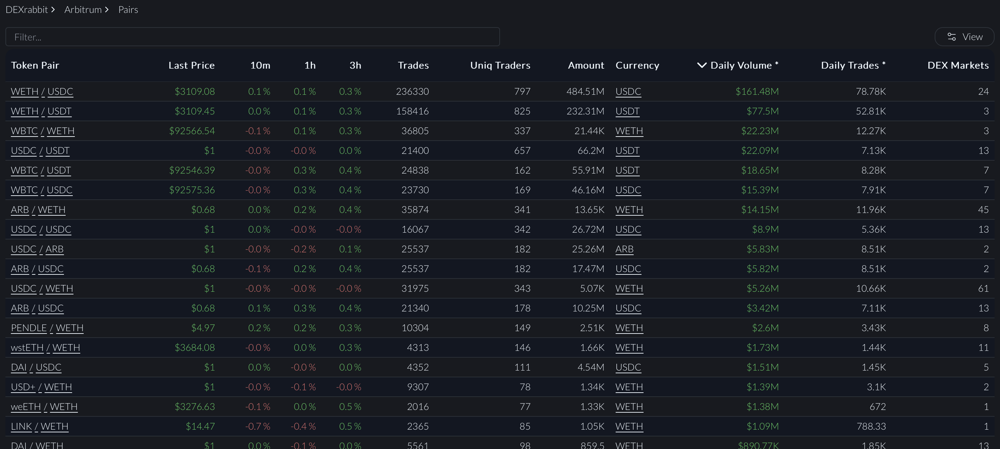
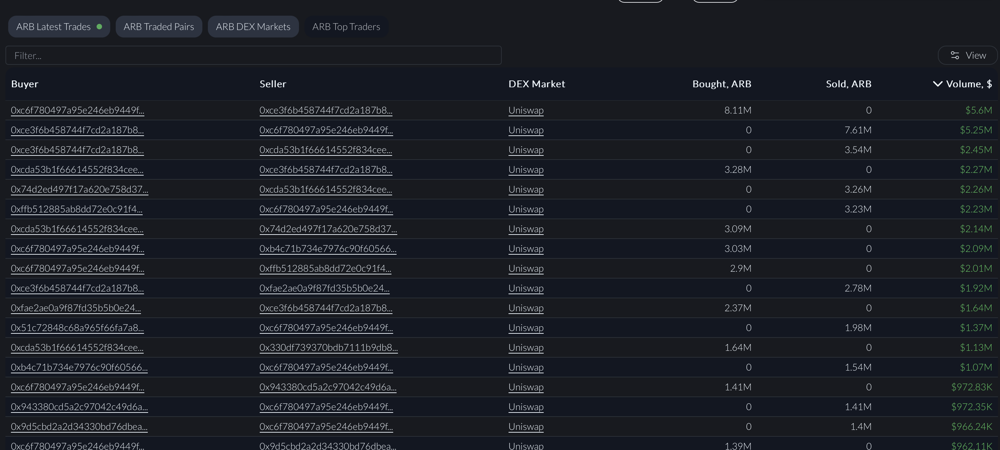

# Arbitrum DEX Trades API

In this section we will see how to get Arbitrum DEX trades information using our API.

<head>
<meta name="title" content="Arbitrum Decentralized Exchange Data with Arbitrum DEX Trades API"/>
<meta name="description" content="Get on-chain data of any Arbitrum Arbitrumd DEX through our DEX Trades API."/>
<meta name="keywords" content="Arbitrum DEX Trades api,Arbitrum DEX Trades python api,Arbitrum DEX Trades token api,Arbitrum Dex NFT api, DEX Trades scan api, DEX Trades api, DEX Trades api docs, DEX Trades crypto api, DEX Trades blockchain api,Arbitrum network api, Arbitrum web3 api"/>
<meta name="robots" content="index, follow"/>
<meta http-equiv="Content-Type" content="text/html; charset=utf-8"/>
<meta name="language" content="English"/>

<!-- Open Graph / Facebook -->

<meta property="og:type" content="website" />
<meta
  property="og:title"
  content="How to Get Arbitrum Decentralized Exchange Data with Arbitrum DEX Trades API"
/>
<meta
  property="og:description"
  content="Get on-chain data of any Arbitrum Arbitrumd DEX through our DEX Trades API."
/>

<!-- Twitter -->

<meta property="twitter:card" content="summary_large_image" />
<meta property="twitter:title" content="How to Get Arbitrum Decentralized Exchange Data with Arbitrum DEX Trades API" />
<meta property="twitter:description" content="Get on-chain data of any Arbitrum Arbitrumd DEX through our DEX Trades API." />
</head>

## Top Trending Pairs on Arbitrum

[This](https://ide.bitquery.io/trending-token-pairs-on-Arbitrum) query returns the top trending pairs traded on Arbitrum Chain based on the trade volume for the last 24 hours, and returns info such as latest price, number of buyers and sellers, number of trades in a day and much more.

```graphql
query pairs(
  $min_count: String
  $network: evm_network
  $time_ago: DateTime
  $time_10min_ago: DateTime
  $time_1h_ago: DateTime
  $time_3h_ago: DateTime
  $weth: String!
  $usdc: String!
  $usdt: String!
  $usdc2: String!
) {
  EVM(network: $network) {
    DEXTradeByTokens(
      where: {
        Block: { Time: { since: $time_ago } }
        any: [
          { Trade: { Side: { Currency: { SmartContract: { is: $usdt } } } } }
          {
            Trade: {
              Side: { Currency: { SmartContract: { is: $usdc } } }
              Currency: { SmartContract: { notIn: [$usdt] } }
            }
          }
          {
            Trade: {
              Side: { Currency: { SmartContract: { is: $usdc2 } } }
              Currency: { SmartContract: { notIn: [$usdt, $usdc] } }
            }
          }
          {
            Trade: {
              Side: { Currency: { SmartContract: { is: $weth } } }
              Currency: { SmartContract: { notIn: [$usdc, $usdt, $usdc2] } }
            }
          }
          {
            Trade: {
              Side: {
                Currency: { SmartContract: { notIn: [$usdc, $usdt, $weth] } }
              }
              Currency: {
                SmartContract: { notIn: [$usdc, $usdc2, $usdt, $weth] }
              }
            }
          }
        ]
      }
      orderBy: { descendingByField: "usd" }
      limit: { count: 100 }
    ) {
      Trade {
        Currency {
          Symbol
          Name
          SmartContract
          ProtocolName
        }
        Side {
          Currency {
            Symbol
            Name
            SmartContract
            ProtocolName
          }
        }
        price_last: PriceInUSD(maximum: Block_Number)
        price_10min_ago: PriceInUSD(
          maximum: Block_Number
          if: { Block: { Time: { before: $time_10min_ago } } }
        )
        price_1h_ago: PriceInUSD(
          maximum: Block_Number
          if: { Block: { Time: { before: $time_1h_ago } } }
        )
        price_3h_ago: PriceInUSD(
          maximum: Block_Number
          if: { Block: { Time: { before: $time_3h_ago } } }
        )
      }
      dexes: uniq(of: Trade_Dex_OwnerAddress)
      amount: sum(of: Trade_Side_Amount)
      usd: sum(of: Trade_Side_AmountInUSD)
      sellers: uniq(of: Trade_Seller)
      buyers: uniq(of: Trade_Buyer)
      count(selectWhere: { ge: $min_count })
    }
  }
}
```

Implementation of this data in a full scale project could be seen on [DEXRabbit](https://dexrabbit.com/arbitrum/pair).



## Latest Trades for a Token Pair on Arbitrum

This query retrieves all DEX trades on the arbitrum where the Arbitrum currency is `ArbitrumCurrency` and the quote currency is `quoteCurrency` that occurred between the specified dates.
You can find the query [here](https://ide.bitquery.io/Pair-last-trades_2)

```
query ($network: evm_network!, $ArbitrumCurrency: String!, $limit: Int, $quoteCurrency: String!, $from: String, $till: String) {
  EVM(network: $network, dataset: archive) {
    sell: DEXTrades(
      where: {Trade: {Sell: {Currency: {SmartContract: {is: $ArbitrumCurrency}}}, Buy: {Currency: {SmartContract: {is: $quoteCurrency}}}}, Block: {Date: {since: $from, till: $till}}}
      orderBy: {descending: Block_Date}
      limit: {count: $limit}
    ) {
      ChainId
      Block {
        Time
        Number
      }
      Trade {
        Sell {
          Buyer
          Amount
          Currency {
            Symbol
            Name
            SmartContract
          }
        }
        Buy {
          Price
          Amount
          Currency {
            Symbol
            SmartContract
            Name
          }
        }
        Dex {
          ProtocolName
          SmartContract
          ProtocolFamily
          ProtocolVersion
        }
      }
    }
  }
}
{
  "network": "arbitrum",
  "limit": 15,
  "from": "2023-09-07",
  "till": "2023-09-07",
  "ArbitrumCurrency": "0xff970a61a04b1ca14834a43f5de4533ebddb5cc8",
  "quoteCurrency": "0x82af49447d8a07e3bd95bd0d56f35241523fbab1"
}

```

## OHLC for a Token Pair

[This](https://ide.bitquery.io/ohlc-for-a-pair-on-Arbitrum_1) query returns the OHLC/K Line Data for a specified token pair. For this example we are considering the ARB `0x912ce59144191c1204e64559fe8253a0e49e6548` and USDC `0xff970a61a04b1ca14834a43f5de4533ebddb5cc8`
pair.

```graphql
query tradingViewPairs(
  $network: evm_network
  $dataset: dataset_arg_enum
  $interval: Int
  $token: String
  $base: String
  $time_ago: DateTime
) {
  EVM(network: $network, dataset: $dataset) {
    DEXTradeByTokens(
      orderBy: { ascendingByField: "Block_Time" }
      where: {
        Trade: {
          Side: {
            Amount: { gt: "0" }
            Currency: { SmartContract: { is: $token } }
          }
          Currency: { SmartContract: { is: $base } }
          PriceAsymmetry: { le: 0.1 }
        }
        Block: { Time: { since: $time_ago } }
      }
    ) {
      Block {
        Time(interval: { count: $interval, in: minutes })
      }
      Trade {
        open: PriceInUSD(minimum: Block_Time)
        close: PriceInUSD(maximum: Block_Time)
        max: PriceInUSD(maximum: Trade_PriceInUSD)
        min: PriceInUSD(minimum: Trade_PriceInUSD)
      }
      volume: sum(of: Trade_AmountInUSD)
    }
  }
}
```

An example for the data visualisation of the data obtained could be seen on the [DEXRabbit](https://dexrabbit.com/arbitrum/pair/0x912ce59144191c1204e64559fe8253a0e49e6548/0xff970a61a04b1ca14834a43f5de4533ebddb5cc8).


## Latest Trades in Realtime with Subscription

This subscription query will return the latest DEX trades on the Arbitrum network in real time.
You can find the query [here](https://ide.bitquery.io/Arbitrum-Dextrades-subscription)

```
subscription {
  EVM(network: arbitrum) {
    DEXTrades {
      Trade {
        Dex {
          ProtocolFamily
          ProtocolName
        }
        Sender
        Buy {
          Amount
          Buyer
          Currency {
            Name
            SmartContract
            Symbol
          }
          Price
          Seller
        }
        Sell {
          Amount
          Buyer
          Currency {
            Name
            Symbol
            SmartContract
          }
          Price
          Seller
        }
      }
    }
  }
}

```

## Top Traders of a Token on Arbitrum

[This](https://ide.bitquery.io/top-traders-for-a-token-on-Arbitrum_1) query returns the top traders of a token on arbitrum based on the volume of trades involving the particular token. This query returns info such as buyers, sellers, DEX Protocol used, amount bought and sold.

```graphql
query topTraders($network: evm_network, $time_ago: DateTime, $token: String) {
  EVM(network: $network) {
    DEXTradeByTokens(
      orderBy: {descendingByField: "volumeUsd"}
      limit: {count: 100}
      where: {Trade: {Currency: {SmartContract: {is: $token}}}, Block: {Time: {since: $time_ago}}}
    ) {
      Trade {
        Buyer
        Seller
        Dex {
          ProtocolFamily
        }
      }
      bought: sum(of: Trade_Amount, if: {Trade: {Side: {Type: {is: sell}}}})
      sold: sum(of: Trade_Amount, if: {Trade: {Side: {Type: {is: buy}}}})
      volume: sum(of: Trade_Amount)
      volumeUsd: sum(of: Trade_Side_AmountInUSD)
    }
  }
}
{
  "network": "arbitrum",
  "token": "0x912ce59144191c1204e64559fe8253a0e49e6548",
  "time_ago": "2024-11-17T08:11:44Z"
}
```

The implementation of this data could also be seen on the [DEXRabbit](https://dexrabbit.com/arbitrum/token/0x912ce59144191c1204e64559fe8253a0e49e6548#top_traders).



The `DEXTrades` API contains the following information about each trade:

- `Dex`: The details of the decentralized exchange where the trade was executed, including the protocol family and the protocol name.
- `Sender`: The address of the sender of the trade.
- `Buy`: The details of the buy order, including the amount of token bought, the buyer's address, the token's symbol, and the price of the trade.
- `Sell`: The details of the sell order, including the amount of token sold, the seller's address, the token's symbol, and the price of the trade.
