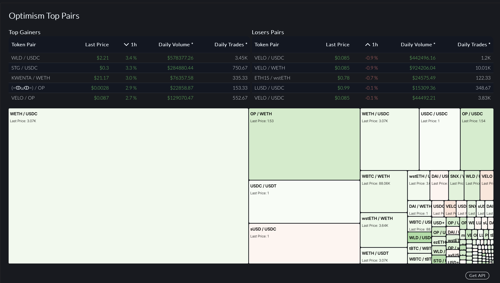
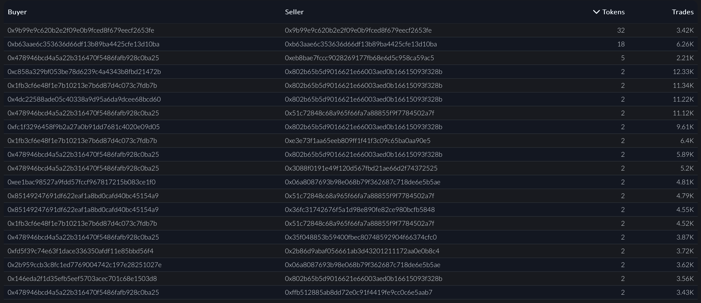
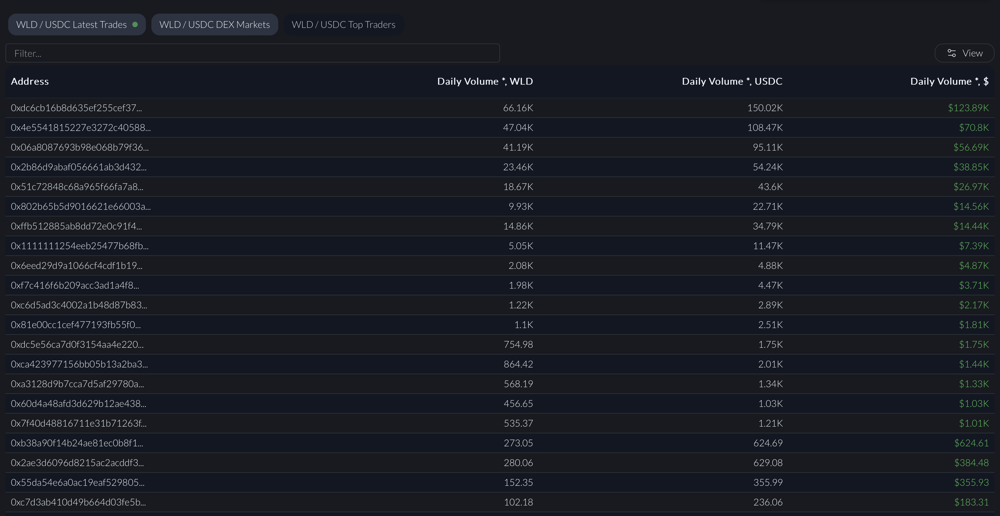
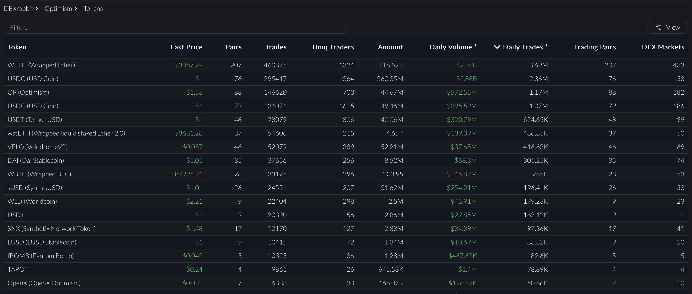

# Optimism DEX Trades API

If you were using Optimism RPC till now to get data, forget about it.

Our Optimism real time streams are perfect alternative for Optimism web3 subscribe.

In this section we will see how to get Optimism DEX trades information using our GraphQL APIs.

This Optimism API is part of our Early Access Program (EAP), which is intended for evaluation purposes. This program allows you to test the data and its integration into your applications before full-scale implementation. Read more [here](https://docs.bitquery.io/docs/graphql/dataset/EAP/)

<head>
<meta name="title" content="How to Get Optimism Decentralized Exchange Data with Optimism DEX Trades API"/>
<meta name="description" content="Get on-chain data of any Optimism based DEX through our DEX Trades API."/>
<meta name="keywords" content="Optimism DEX Trades api,Optimism DEX Trades python api,Optimism DEX Trades token api,Optimism Dex NFT api, DEX Trades scan api, DEX Trades api, DEX Trades api docs, DEX Trades crypto api, DEX Trades blockchain api,Optimism network api, Optimism web3 api"/>
<meta name="robots" content="index, follow"/>
<meta http-equiv="Content-Type" content="text/html; charset=utf-8"/>
<meta name="language" content="English"/>

<!-- Open Graph / Facebook -->

<meta property="og:type" content="website" />
<meta
  property="og:title"
  content="How to Get Optimism Decentralized Exchange Data with Optimism DEX Trades API"
/>
<meta
  property="og:description"
  content="Get on-chain data of any Optimism based DEX through our DEX Trades API."
/>

<!-- Twitter -->

<meta property="twitter:card" content="summary_large_image" />
<meta property="twitter:title" content="How to Get Optimism Decentralized Exchange Data with Optimism DEX Trades API" />
<meta property="twitter:description" content="Get on-chain data of any Optimism based DEX through our DEX Trades API." />
</head>

## Top Trending Pairs on Optimism
[This](https://ide.bitquery.io/trending-pairs-on-optimism) query returns the top trending trading pairs on Optimism based on the `Trade Volume`, and returns info like unique buyers and sellers, number of markets where the pair exist, latest price and price at a given time and much more.

``` graphql

query pairs($min_count: String, $network: evm_network, $time_ago: DateTime, $time_10min_ago: DateTime, $time_1h_ago: DateTime, $time_3h_ago: DateTime, $weth: String!, $usdc: String!, $usdt: String!, $usdc2: String!) {
  EVM(network: $network) {
    DEXTradeByTokens(
      where: {Block: {Time: {since: $time_ago}}, any: [{Trade: {Side: {Currency: {SmartContract: {is: $usdt}}}}}, {Trade: {Side: {Currency: {SmartContract: {is: $usdc}}}, Currency: {SmartContract: {notIn: [$usdt]}}}}, {Trade: {Side: {Currency: {SmartContract: {is: $usdc2}}}, Currency: {SmartContract: {notIn: [$usdt, $usdc]}}}}, {Trade: {Side: {Currency: {SmartContract: {is: $weth}}}, Currency: {SmartContract: {notIn: [$usdc, $usdt, $usdc2]}}}}, {Trade: {Side: {Currency: {SmartContract: {notIn: [$usdc, $usdt, $weth]}}}, Currency: {SmartContract: {notIn: [$usdc, $usdc2, $usdt, $weth]}}}}]}
      orderBy: {descendingByField: "usd"}
      limit: {count: 100}
    ) {
      Trade {
        Currency {
          Symbol
          Name
          SmartContract
          ProtocolName
        }
        Side {
          Currency {
            Symbol
            Name
            SmartContract
            ProtocolName
          }
        }
        price_last: PriceInUSD(maximum: Block_Number)
        price_10min_ago: PriceInUSD(
          maximum: Block_Number
          if: {Block: {Time: {before: $time_10min_ago}}}
        )
        price_1h_ago: PriceInUSD(
          maximum: Block_Number
          if: {Block: {Time: {before: $time_1h_ago}}}
        )
        price_3h_ago: PriceInUSD(
          maximum: Block_Number
          if: {Block: {Time: {before: $time_3h_ago}}}
        )
      }
      dexes: uniq(of: Trade_Dex_OwnerAddress)
      amount: sum(of: Trade_Side_Amount)
      usd: sum(of: Trade_Side_AmountInUSD)
      sellers: uniq(of: Trade_Seller)
      buyers: uniq(of: Trade_Buyer)
      count(selectWhere: {ge: $min_count})
    }
  }
}

```

The example of this could be seen on the [DEXRabbit](https://dexrabbit.com/optimism).



## Subscribe to Latest Optimism Trades

This subscription will return information about the most recent trades executed on Optimism's DEX platforms.
You can find the query [here](https://ide.bitquery.io/Realtime-optimism-dex-trades-websocket)

```
subscription {
  EVM(network: optimism) {
    DEXTrades {
      Block {
        Time
      }
      Trade {
        Dex {
          ProtocolName
          ProtocolFamily
          SmartContract
        }
        Buy {
          Amount
          Buyer
          Seller
          Currency {
            Decimals
            Fungible
            HasURI
            Name
            ProtocolName
            SmartContract
            Symbol
          }
          OrderId
        }
        Sell {
          Buyer
          Seller
          Currency {
            Decimals
            Fungible
            HasURI
            Name
            ProtocolName
            SmartContract
            Symbol
          }
        }
      }
    }
  }
}


```

## Get Top Traders on Optimism
[This](https://ide.bitquery.io/top-traders-on-optimism) query returns the top traders om Optimism chain based on the number of unique tokens held and number of trades. This also provides info like `Buyer Address` and `Seller Address`.

``` graphql

query topTraders($network: evm_network, $time_ago: DateTime) {
  EVM(network: $network) {
    DEXTradeByTokens(
      orderBy: {descendingByField: "trades"}
      limit: {count: 100}
      where: {Block: {Time: {since: $time_ago}}}
    ) {
      Trade {
        Seller
        Buyer
      }
      trades: count(if: {Trade: {Side: {Type: {is: buy}}}})
      tokens: uniq(of: Trade_Currency_SmartContract)
    }
  }
}

```

You can checkout a completed product using this info on [DEXRabbit](https://dexrabbit.com/optimism/trader).



## Get Top Traders for a Pair on Optimism
[This](https://ide.bitquery.io/top-traders-for-wld-usdc-pair) query returns the top traders of a pair based on the trade volume in USD. For this example we are taking the pair of WLD `0xdc6ff44d5d932cbd77b52e5612ba0529dc6226f1` and USDC `0x0b2c639c533813f4aa9d7837caf62653d097ff85`, including amount sold, amount bought, volume and volume in USD.

``` graphql

query pairTopTraders($network: evm_network, $token: String, $base: String, $time_ago: DateTime) {
  EVM(network: $network) {
    DEXTradeByTokens(
      orderBy: {descendingByField: "volumeUsd"}
      limit: {count: 100}
      where: {Trade: {Currency: {SmartContract: {is: $base}}, Side: {Amount: {gt: "0"}, Currency: {SmartContract: {is: $token}}}}, Block: {Time: {since: $time_ago}}}
    ) {
      Trade {
        Buyer
      }
      bought: sum(of: Trade_Amount, if: {Trade: {Side: {Type: {is: buy}}}})
      sold: sum(of: Trade_Amount, if: {Trade: {Side: {Type: {is: sell}}}})
      volume: sum(of: Trade_Amount)
      sideVolume: sum(of: Trade_Side_Amount)
      volumeUsd: sum(of: Trade_Side_AmountInUSD)
    }
  }
}

```
An example for the same could be seen in the [DEXRabbit](https://dexrabbit.com/optimism/pair/0xdc6ff44d5d932cbd77b52e5612ba0529dc6226f1/0x0b2c639c533813f4aa9d7837caf62653d097ff85#pair_top_traders) as shown below.



## Subscribe to Latest Price of a Token in Real-time

This query provides real-time updates on price of WETH `0x4200000000000000000000000000000000000006` in terms of USD Coin `0x7f5c764cbc14f9669b88837ca1490cca17c31607`, including details about the DEX, market, and order specifics. Find the query [here](https://ide.bitquery.io/Price-of-WETH-in-terms-of-USDC-on-Optimism#)

```
subscription {
  EVM(network: optimism) {
    DEXTrades(
      where: {Trade: {Sell: {Currency: {SmartContract: {is: "0x4200000000000000000000000000000000000006"}}}, Buy: {Currency: {SmartContract: {is: "0x7f5c764cbc14f9669b88837ca1490cca17c31607"}}}}}
    ) {
      Block {
        Time
      }
      Trade {
        Buy {
          Amount
          Buyer
          Seller
          Price_in_terms_of_sell_currency: Price
          Currency {
            Name
            Symbol
            SmartContract
          }
        }
        Sell {
          Amount
          Buyer
          Seller
          Price_in_terms_of_buy_currency: Price
          Currency {
            Symbol
            SmartContract
            Name
          }
        }
      }
    }
  }
}

```

## Top Trending Tokens on Optimism
[This](https://ide.bitquery.io/top-tokens-on-optimism) query returns the top trending token info based on the number of trades and returns values like number of unique buyers, sellers, markets, pools along with volume in USD.

``` graphql

query topTokens($network: evm_network, $time_ago: DateTime!) {
  EVM(network: $network) {
    DEXTradeByTokens(
      orderBy: {descendingByField: "count"}
      limit: {count: 100}
      where: {Block: {Time: {since: $time_ago}}}
    ) {
      Trade {
        Currency {
          Symbol
          SmartContract
          Fungible
          Name
        }
        Amount(maximum: Block_Number)
        AmountInUSD(maximum: Block_Number)
      }
      pairs: uniq(of: Trade_Side_Currency_SmartContract)
      dexes: uniq(of: Trade_Dex_SmartContract)
      amount: sum(of: Trade_Amount)
      usd: sum(of: Trade_AmountInUSD)
      buyers: uniq(of: Trade_Buyer)
      sellers: uniq(of: Trade_Sender)
      count
    }
  }
}

```

An example of the utilisation of this data could be seen on [DEXRabbit](https://dexrabbit.com/optimism/token).



## Latest USD Price of a Token

The below query retrieves the USD price of a token on Optimism by setting `SmartContract: {is: "0x68f180fcCe6836688e9084f035309E29Bf0A2095"}` . Check the field `PriceInUSD` for the USD value. You can access the query [here](https://ide.bitquery.io/Get-latest-price-of-WBTC-in-USD-on-optimism#).

```
subscription {
  EVM(network: optimism) {
    DEXTradeByTokens(
      where: {Trade: {Currency: {SmartContract: {is: "0x68f180fcCe6836688e9084f035309E29Bf0A2095"}}}}
    ) {
      Transaction {
        Hash
      }
      Trade {
        Buyer
        AmountInUSD
        Amount
        Price
        PriceInUSD
        Seller
        Currency {
          Name
          Symbol
          SmartContract
        }
        Dex {
          ProtocolFamily
          SmartContract
          ProtocolName
        }
        Side {
          Amount
          AmountInUSD
          Buyer
          Seller
          Currency {
            Name
            SmartContract
            Symbol
          }
        }
      }
    }
  }
}


```
