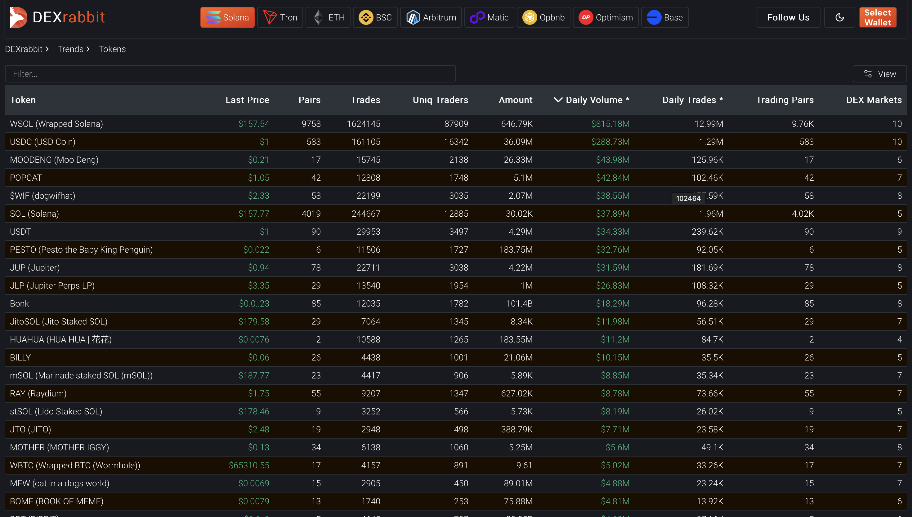

# Solana DEX Trades API

In this section we will see how to get Solana DEX trades information using our API.

This Solana API is part of our Early Access Program (EAP). This program allows you to test the data and its integration into your applications before full-scale implementation. Read more [here](https://docs.bitquery.io/docs/graphql/dataset/EAP/).

**Individual trades are currently only supported for the real-time dataset, which includes real-time information and approximately 8 hours of historical trades. Aggregates like OHLC are available for historical data.**
:::note
`Trade Side Account` field will not be available for aggregate queries in Archive and Combined Datasets
:::

<head>
<meta name="title" content="Solana DEX Trades API | Get Raydium, Jupiter data"/>
<meta name="description" content="Get on-chain data of liquidity pools and trading pairs from any Solana based DEX like Raydium, Jupiter, etc through our DEX Trades API."/>
<meta name="keywords" content="Solana DEX Trades api,Solana DEX Trades python api,Solana DEX Trades token api,Solana Dex NFT api, DEX Trades scan api, DEX Trades api, DEX Trades api docs, DEX Trades crypto api, DEX Trades blockchain api,solana network api, solana web3 api"/>
<meta name="robots" content="index, follow"/>
<meta http-equiv="Content-Type" content="text/html; charset=utf-8"/>
<meta name="language" content="English"/>

<!-- Open Graph / Facebook -->

<meta property="og:type" content="website" />
<meta
  property="og:title"
  content="Solana DEX Trades API | Get Raydium, Jupiter data"
/>
<meta
  property="og:description"
  content="Get on-chain data of liquidity pools and trading pairs from any Solana based DEX like Raydium, Jupiter, etc through our DEX Trades API."
/>

<!-- Twitter -->

<meta property="twitter:card" content="summary_large_image" />
<meta property="twitter:title" content="Solana DEX Trades API | Get Raydium, Jupiter data" />
<meta property="twitter:description" content="Get on-chain data of liquidity pools and trading pairs from any Solana based DEX like Raydium, Jupiter, etc through our DEX Trades API." />
</head>

import VideoPlayer from "../../../src/components/videoplayer.js";

## Subscribe to Latest Solana Trades

This subscription will return information about the most recent trades executed on Solana's DEX platforms.
You can find the query [here](https://ide.bitquery.io/solana-trades-subscription_3)

```
subscription {
  Solana {
    DEXTrades {
      Block{
        Time
        Slot
      }
      Transaction{
        Signature
        Index
        Result{
          Success
        }
      }
      Trade {
        Index
        Dex {
          ProgramAddress
          ProtocolFamily
          ProtocolName
        }
        Buy {
          Amount
          Account {
            Address
          }
          Currency {
            MetadataAddress
            Key
            MintAddress
            IsMutable
            EditionNonce
            Decimals
            CollectionAddress
            Fungible
            Symbol
            Native
            Name
          }
          Price
          PriceInUSD
          Order {
            LimitPrice
            LimitAmount
            OrderId
          }

        }
        Market {
          MarketAddress
        }
        Sell {
          Account {
            Address
          }
          Currency {
            IsMutable
            Decimals
            CollectionAddress
            Fungible
            Symbol
            Native
            Name
          }
          Price
          PriceInUSD
        }
      }
    }
  }
}
```

## Get Price of a Token Against WSOL

This query retrieves the latest price of a token against Wrapped SOL (WSOL) on Solana.

Specify the token pair:

- MintAddress of the token to query: "CzLSujWBLFsSjncfkh59rUFqvafWcY5tzedWJSuypump"
- MintAddress for WSOL: "So111111111111111111111111111111111111111

You can run the query [here](https://ide.bitquery.io/Price-of-a-Token-Against-WSOL)

```
query LatestTrades {
  Solana {
    DEXTradeByTokens(
      orderBy: {descending: Block_Time}
      limit: {count: 1}
      where: {Trade: {Currency: {MintAddress: {is: "CzLSujWBLFsSjncfkh59rUFqvafWcY5tzedWJSuypump"}}, Side: {Currency: {MintAddress: {is: "So11111111111111111111111111111111111111112"}}}}}
    ) {
      Block {
        allTime: Time
      }
      Transaction {
        Signature
      }
      Trade {
        Market {
          MarketAddress
        }
        Dex {
          ProtocolName
          ProtocolFamily
        }
        AmountInUSD
        Price
        PriceInUSD
        Amount
        Side {
          Type
          Currency {
            Symbol
            MintAddress
            Name
          }
          AmountInUSD
          Amount
        }
      }
    }
  }
}
```

## Get Latest Trades of a token

This query will return information about the most recent trades executed for this token `CzLSujWBLFsSjncfkh59rUFqvafWcY5tzedWJSuypump` on Solana's DEX platforms.
You can find the query [here](https://ide.bitquery.io/Latest-Trades-of-Trump-COin)

```
query LatestTrades($token: String, $base: String) {
  Solana {
    DEXTradeByTokens(
      orderBy: {descending: Block_Time}
      limit: {count: 50}
      where: {Trade: {Side: {Amount: {gt: "0"}, Currency: {MintAddress: {is: $base}}}, Currency: {MintAddress: {is: $token}}, Price: {gt: 0}}, Transaction: {Result: {Success: true}}}
    ) {
      Block {
        allTime: Time
      }
      Trade {
        Dex {
          ProgramAddress
          ProtocolFamily
          ProtocolName
        }
        Account {
          Owner
        }
        Side {
          Type
          Account {
            Address
            Owner
          }
        }
        Price
        Amount
        Side {
          Currency {
            Symbol
            MintAddress
            Name
          }
          AmountInUSD
          Amount
        }
      }
    }
  }
}
{
  "token": "CzLSujWBLFsSjncfkh59rUFqvafWcY5tzedWJSuypump",
  "base": "So11111111111111111111111111111111111111112"
}
```


Check data here on [DEXrabbit](https://dexrabbit.com/solana/pair/59VxMU35CaHHBTndQQWDkChprM5FMw7YQi5aPE5rfSHN/So11111111111111111111111111111111111111112#pair_latest_trades).

## Calculate Price Surge of a Token

While the V2 API does not support expressions yet you can get the price data between two timestamps and compute the price surge in your system.

Below query gets the price of a token at the starting and ending of a period ( open and close).
You can run the query [here](https://ide.bitquery.io/Price-change-of-a-token-in-time-period-on-Solana)

```
query MyQuery {
  Solana(dataset: realtime) {
    DEXTradeByTokens(
      where: {Trade: {Currency: {MintAddress: {is: "J1toso1uCk3RLmjorhTtrVwY9HJ7X8V9yYac6Y7kGCPn"}}, Side: {Currency: {MintAddress: {is: "So11111111111111111111111111111111111111112"}}}}, Block: {Time: {since: "2025-01-21T04:00:00Z", till: "2025-01-21T08:00:00Z"}}}
    ) {
      Trade {
        Dex {
          ProtocolName
        }
        open: Price(minimum: Block_Time)
        close: Price(maximum: Block_Time)
      }
    }
  }
}


```

## Get Trade Summary of a Trade

A lot of times a trade is implemented using multiple swaps. The summary of these trades are the token originally sold and the token finally purchased.
To get the summary for such trades use [this](https://ide.bitquery.io/trade-summary_1) query.

```graphql
{
  Solana {
    DEXTrades(
      where: {
        Transaction: {
          Signer: { is: "9B4okPpQcz1MSt8cLLb7YGo2NKvgsw82pEhHqKsKW9uS" }
          Result: { Success: true }
        }
      }
      orderBy: { descending: Block_Time }
    ) {
      Trade {
        Buy {
          Amount
          PriceInUSD
          Currency {
            Decimals
            Name
            MintAddress
            Symbol
          }
          Account {
            Address
            Owner
          }
        }
        Dex {
          ProgramAddress
          ProtocolFamily
          ProtocolName
        }
        Sell {
          Amount
          Price
          Currency {
            Name
            Symbol
            MintAddress
            Decimals
          }
        }
        Index
      }
      Transaction {
        Signature
        Result {
          Success
        }
      }
      Block {
        Time
      }
    }
  }
}
```

The response of the query is given below. Given multiple trades with same `Block Time`, the summary is
given by the `sell currency` for the lowest Trade Index and the `buy currency` for the highest Trade Index.

```json

{
        "Block": {
          "Time": "2024-11-12T05:56:55Z"
        },
        "Trade": {
          "Buy": {
            "Account": {
              "Address": "FJnivW3jSXVuR2P6Z6e9iRkVHEyEzppHcnUdMgsLBSgY",
              "Owner": "4xDsmeTWPNjgSVSS1VTfzFq3iHZhp77ffPkAmkZkdu71"
            },
            "Amount": "7599.73089",
            "Currency": {
              "Decimals": 5,
              "MintAddress": "DezXAZ8z7PnrnRJjz3wXBoRgixCa6xjnB7YaB1pPB263",
              "Name": "Bonk",
              "Symbol": "Bonk"
            },
            "PriceInUSD": 0.000028919810335657223
          },
          "Dex": {
            "ProgramAddress": "LBUZKhRxPF3XUpBCjp4YzTKgLccjZhTSDM9YuVaPwxo",
            "ProtocolFamily": "Meteora",
            "ProtocolName": "lb_clmm"
          },
          "Index": 0,
          "Sell": {
            "Amount": "0.219833",
            "Currency": {
              "Decimals": 6,
              "MintAddress": "EPjFWdd5AufqSSqeM2qN1xzybapC8G4wEGGkZwyTDt1v",
              "Name": "USD Coin",
              "Symbol": "USDC"
            },
            "Price": 34570.47345030091
          }
        },
        "Transaction": {
          "Result": {
            "Success": true
          },
          "Signature": "43aymSmr2op2aEnCiMfzkqqfpWwSofWk8EBcUWhKEUsHRrZV4KpTGW4iuxLxJyS1HKoLS7gTamzuqKiwi3e3z4Li"
        }
      },

```

## Get the historical Created pairs on any Solana DEX

This query will return information about the historical created pairs according to the selected date frame.
You can find the query [here](https://ide.bitquery.io/Solana-Raydium-New-Pairs_2)

```
query{
  Solana(dataset: archive) {
    DEXTradeByTokens(
      where: {
        Trade: {
          Dex: {
            ProtocolFamily: {
              is: "Raydium"
            }
					}
        }
      }
      limit: {
      count: 100
    }) {
      Block {
        Date(minimum: Block_Date
        selectWhere: {
          since: "2024-10-01"
          till: "2024-11-01"
        })
      }
      Trade {
        Dex {
          ProtocolFamily
        }
        Market{
          MarketAddress
        }
        Currency {
          Symbol
          MintAddress
        }
        Side {
          Currency {
            Symbol
            MintAddress
          }
        }
      }
    }
  }
}
```

## Get Buy Volume, Sell Volume, Buys, Sells, Makers, Total Trade Volume, Buyers, Sellers of a specific Token

The below query gives you the essential stats for a token such as buy volume, sell volume, total buys, total sells, makers, total trade volume, buyers, sellers (in last 5 min, 1 hour) of a specific token.
You can run the query [here](https://ide.bitquery.io/Buys-Sells-BuyVolume-SellVolume-Makers-TotalTradedVolume-PriceinUSD-for-solana-token-pair)

```graphql
query MyQuery($token: String!, $side_token: String!, $pair_address: String!, $time_5min_ago: DateTime!, $time_1h_ago: DateTime!) {
  Solana(dataset: realtime) {
    DEXTradeByTokens(
      where: {Transaction: {Result: {Success: true}}, Trade: {Currency: {MintAddress: {is: $token}}, Side: {Currency: {MintAddress: {is: $side_token}}}, Market: {MarketAddress: {is: $pair_address}}}, Block: {Time: {since: $time_1h_ago}}}
    ) {
      Trade {
        Currency {
          Name
          MintAddress
          Symbol
        }
        start: PriceInUSD(minimum: Block_Time)
        min5: PriceInUSD(
          minimum: Block_Time
          if: {Block: {Time: {after: $time_5min_ago}}}
        )
        end: PriceInUSD(maximum: Block_Time)
        Dex {
          ProtocolName
          ProtocolFamily
          ProgramAddress
        }
        Market {
          MarketAddress
        }
        Side {
          Currency {
            Symbol
            Name
            MintAddress
          }
        }
      }
      makers: count(distinct: Transaction_Signer)
      makers_5min: count(
        distinct: Transaction_Signer
        if: {Block: {Time: {after: $time_5min_ago}}}
      )
      buyers: count(
        distinct: Transaction_Signer
        if: {Trade: {Side: {Type: {is: buy}}}}
      )
      buyers_5min: count(
        distinct: Transaction_Signer
        if: {Trade: {Side: {Type: {is: buy}}}, Block: {Time: {after: $time_5min_ago}}}
      )
      sellers: count(
        distinct: Transaction_Signer
        if: {Trade: {Side: {Type: {is: sell}}}}
      )
      sellers_5min: count(
        distinct: Transaction_Signer
        if: {Trade: {Side: {Type: {is: sell}}}, Block: {Time: {after: $time_5min_ago}}}
      )
      trades: count
      trades_5min: count(if: {Block: {Time: {after: $time_5min_ago}}})
      traded_volume: sum(of: Trade_Side_AmountInUSD)
      traded_volume_5min: sum(
        of: Trade_Side_AmountInUSD
        if: {Block: {Time: {after: $time_5min_ago}}}
      )
      buy_volume: sum(
        of: Trade_Side_AmountInUSD
        if: {Trade: {Side: {Type: {is: buy}}}}
      )
      buy_volume_5min: sum(
        of: Trade_Side_AmountInUSD
        if: {Trade: {Side: {Type: {is: buy}}}, Block: {Time: {after: $time_5min_ago}}}
      )
      sell_volume: sum(
        of: Trade_Side_AmountInUSD
        if: {Trade: {Side: {Type: {is: sell}}}}
      )
      sell_volume_5min: sum(
        of: Trade_Side_AmountInUSD
        if: {Trade: {Side: {Type: {is: sell}}}, Block: {Time: {after: $time_5min_ago}}}
      )
      buys: count(if: {Trade: {Side: {Type: {is: buy}}}})
      buys_5min: count(
        if: {Trade: {Side: {Type: {is: buy}}}, Block: {Time: {after: $time_5min_ago}}}
      )
      sells: count(if: {Trade: {Side: {Type: {is: sell}}}})
      sells_5min: count(
        if: {Trade: {Side: {Type: {is: sell}}}, Block: {Time: {after: $time_5min_ago}}}
      )
    }
  }
}
{
  "token":"2qEHjDLDLbuBgRYvsxhc5D6uDWAivNFZGan56P1tpump",
  "side_token": ""So11111111111111111111111111111111111111112",
  "pair_address: "4AZRPNEfCJ7iw28rJu5aUyeQhYcvdcNm8cswyL51AY9i",
  "time_5min_ago":"2024-11-06T15:13:00Z",
  "time_1h_ago": "2024-11-06T14:18:00Z"
}
```

## Top 10 Trending Solana Tokens

[This](https://ide.bitquery.io/Trending-tokens-on--Solana_2) query returns the top 10 trending tokens on Solana across all DEXs based on the number of trades with unique traders.
[This](https://ide.bitquery.io/Trending-tokens-on--Solana-for-one-hour) query returns the trending list of tokens for a particular time period, `1 hour` in this case.

```graphql
query TrendingTokens {
  Solana {
    DEXTradeByTokens(
      limit: { count: 10 }
      orderBy: { descendingByField: "tradesCountWithUniqueTraders" }
    ) {
      Trade {
        Currency {
          Name
          Symbol
          MintAddress
        }
      }
      tradesCountWithUniqueTraders: count(distinct: Transaction_Signer)
    }
  }
}
```

You can also checkout how such queries are used as a base to completed features such as [DEXrabbit Solana Trends](https://dexrabbit.com/solana/token) as shown in the image below.



## Get DEX Markets for a Token

This query will give you Solana DEXs on which the token `59VxMU35CaHHBTndQQWDkChprM5FMw7YQi5aPE5rfSHN` is getting traded.
You can find the query [here](https://ide.bitquery.io/DEX-Markets-for-a-token)

```
query ($token: String, $base: String, $time_10min_ago: DateTime, $time_1h_ago: DateTime, $time_3h_ago: DateTime) {
  Solana {
    DEXTradeByTokens(
      orderBy: {descendingByField: "amount"}
      where: {Trade: {Currency: {MintAddress: {is: $token}}, Side: {Amount: {gt: "0"}, Currency: {MintAddress: {is: $base}}}}, Transaction: {Result: {Success: true}}, Block: {Time: {after: $time_3h_ago}}}
    ) {
      Trade {
        Dex {
          ProtocolFamily
          ProtocolName
        }
        price_last: PriceInUSD(maximum: Block_Slot)
        price_10min_ago: PriceInUSD(
          maximum: Block_Slot
          if: {Block: {Time: {before: $time_10min_ago}}}
        )
        price_1h_ago: PriceInUSD(
          maximum: Block_Slot
          if: {Block: {Time: {before: $time_1h_ago}}}
        )
        price_3h_ago: PriceInUSD(minimum: Block_Slot)
      }
      amount: sum(of: Trade_Side_Amount)
      pairs: uniq(of: Trade_Side_Currency_MintAddress)
      trades: count
    }
  }
}
{
  "token": "59VxMU35CaHHBTndQQWDkChprM5FMw7YQi5aPE5rfSHN",
  "base": "So11111111111111111111111111111111111111112",
  "time_10min_ago": "2024-09-19T10:45:46Z",
  "time_1h_ago": "2024-09-19T09:55:46Z",
  "time_3h_ago": "2024-09-19T07:55:46Z"
}
```


Check data here on [DEXrabbit](https://dexrabbit.com/solana/pair/59VxMU35CaHHBTndQQWDkChprM5FMw7YQi5aPE5rfSHN/So11111111111111111111111111111111111111112#pair_dex_list).

## Get Token creation date

You can use the below query to get any token's creation time. Note that we are providing first trade time which in most of the cases is around creation time only. Try the query on ide [here](https://ide.bitquery.io/Token-creation-time_1)

```
{
 Solana(dataset: combined) {
  DEXTradeByTokens(
   where: {Trade: {Currency: {MintAddress: {is: "94vNH3HhLv42gfkF93n9EQq9vyHPKRZ5XG6U3HmDpump"}}}}
  ) {
   Block {
    Time(minimum: Block_Time)
   }
  }
 }
}
```

## Get Solana Price in Realtime

You can use the below stream to get the Solana price. Try the query on ide [here](https://ide.bitquery.io/solana-price-stream)

```
subscription {
  Solana {
    DEXTrades(
      where: {Trade: {Sell: {Currency: {MintAddress: {in: ["So11111111111111111111111111111111111111112", "11111111111111111111111111111111"]}}}}}
    ) {
      Block {
        Time
      }
      Trade {
        Buy {
          Price
          PriceInUSD
          Currency {
            Name
            Symbol
            MintAddress
          }
        }
      }
    }
  }
}
```

## Get Top Bought Tokens on Solana

This query will give you most bought Solana Tokens on Raydium.
You can find the query [here](https://ide.bitquery.io/Top-Bought-Solana-Tokens)

```
{
  Solana {
    DEXTradeByTokens(
      orderBy: {descendingByField: "buy"}
      where: {Trade: {Currency: {MintAddress: {notIn: ["So11111111111111111111111111111111111111112", "EPjFWdd5AufqSSqeM2qN1xzybapC8G4wEGGkZwyTDt1v"]}}, Dex: {ProtocolFamily: {is: "Raydium"}}}, Transaction: {Result: {Success: true}}}
      limit: {count: 100}
    ) {
      Trade {
        Currency {
          Symbol
          Name
          MintAddress
        }
      }
      buy: sum(of: Trade_Side_AmountInUSD, if: {Trade: {Side: {Type: {is: buy}}}})
      sell: sum(of: Trade_Side_AmountInUSD, if: {Trade: {Side: {Type: {is: sell}}}})
    }
  }
}
```

Arranged in the descending order of `bought - sold` on [DEXrabbit](https://dexrabbit.com/solana).


Check data here on [DEXrabbit](https://dexrabbit.com/solana).

## Get Top Sold Tokens on Solana

This query will give you most sold Solana Tokens on Raydium.
You can find the query [here](https://ide.bitquery.io/Top-sold-Solana-Tokens)

```
{
  Solana {
    DEXTradeByTokens(
      orderBy: {descendingByField: "sell"}
      where: {Trade: {Currency: {MintAddress: {notIn: ["So11111111111111111111111111111111111111112", "EPjFWdd5AufqSSqeM2qN1xzybapC8G4wEGGkZwyTDt1v"]}}, Dex: {ProtocolFamily: {is: "Raydium"}}}, Transaction: {Result: {Success: true}}}
      limit: {count: 100}
    ) {
      Trade {
        Currency {
          Symbol
          Name
          MintAddress
        }
      }
      buy: sum(of: Trade_Side_AmountInUSD, if: {Trade: {Side: {Type: {is: buy}}}})
      sell: sum(of: Trade_Side_AmountInUSD, if: {Trade: {Side: {Type: {is: sell}}}})
    }
  }
}
```

Arranged in the descending order of `sold - bought` on [DEXrabbit](https://dexrabbit.com/solana).


Check data here on [DEXrabbit](https://dexrabbit.com/solana).

## Get Top Traded Pairs

This query will give you top traded pairs data.
You can find the query [here](https://ide.bitquery.io/top-trading-pairs)

```
query ($time_10min_ago: DateTime, $time_1h_ago: DateTime, $time_3h_ago: DateTime) {
  Solana {
    DEXTradeByTokens(
      where: {Transaction: {Result: {Success: true}}, Block: {Time: {after: $time_3h_ago}}, any: [{Trade: {Side: {Currency: {MintAddress: {is: "EPjFWdd5AufqSSqeM2qN1xzybapC8G4wEGGkZwyTDt1v"}}}}}, {Trade: {Currency: {MintAddress: {not: "EPjFWdd5AufqSSqeM2qN1xzybapC8G4wEGGkZwyTDt1v"}}, Side: {Currency: {MintAddress: {is: "So11111111111111111111111111111111111111112"}}}}}, {Trade: {Currency: {MintAddress: {notIn: ["So11111111111111111111111111111111111111112", "EPjFWdd5AufqSSqeM2qN1xzybapC8G4wEGGkZwyTDt1v"]}}, Side: {Currency: {MintAddress: {notIn: ["So11111111111111111111111111111111111111112", "EPjFWdd5AufqSSqeM2qN1xzybapC8G4wEGGkZwyTDt1v"]}}}}}]}
      orderBy: {descendingByField: "usd"}
      limit: {count: 100}
    ) {
      Trade {
        Currency {
          Symbol
          Name
          MintAddress
        }
        Side {
          Currency {
            Symbol
            Name
            MintAddress
          }
        }
        price_last: PriceInUSD(maximum: Block_Slot)
        price_10min_ago: PriceInUSD(
          maximum: Block_Slot
          if: {Block: {Time: {before: $time_10min_ago}}}
        )
        price_1h_ago: PriceInUSD(
          maximum: Block_Slot
          if: {Block: {Time: {before: $time_1h_ago}}}
        )
        price_3h_ago: PriceInUSD(minimum: Block_Slot)
      }
      dexes: uniq(of: Trade_Dex_ProgramAddress)
      amount: sum(of: Trade_Side_Amount)
      usd: sum(of: Trade_Side_AmountInUSD)
      traders: uniq(of: Trade_Account_Owner)
      count(selectWhere: {ge: "100"})
    }
  }
}
{
  "time_10min_ago": "2024-09-19T12:26:17Z",
  "time_1h_ago": "2024-09-19T11:36:17Z",
  "time_3h_ago": "2024-09-19T09:36:17Z"
}
```


Check data here on [DEXrabbit](https://dexrabbit.com/solana/pair).

## Get Top DEXs information

This query will give you top DEXs info.
You can find the query [here](https://ide.bitquery.io/top-dexs)

```
query DexMarkets {
  Solana {
    DEXTradeByTokens {
      Trade {
        Dex {
          ProtocolFamily
        }
      }
      traders: uniq(of: Trade_Account_Owner)
      count(if: {Trade: {Side: {Type: {is: buy}}}})
    }
    DEXPools {
      Pool {
        Dex {
          ProtocolFamily
        }
      }
      pools: uniq(of: Pool_Market_MarketAddress)
    }
  }
}
```


Check data here on [DEXrabbit](https://dexrabbit.com/solana/dex_market).

## Get All Traded Pairs Info of a Token

This query will give you the information on all the traded pairs of a particular token `EKpQGSJtjMFqKZ9KQanSqYXRcF8fBopzLHYxdM65zcjm`.
You can find the query [here](https://ide.bitquery.io/traded-pairs-of-a-token)

```
query ($token: String, $time_10min_ago: DateTime, $time_1h_ago: DateTime, $time_3h_ago: DateTime) {
  Solana {
    DEXTradeByTokens(
      orderBy: {descendingByField: "usd"}
      where: {Trade: {Currency: {MintAddress: {is: $token}}}, Transaction: {Result: {Success: true}}, Block: {Time: {after: $time_3h_ago}}}
      limit: {count: 200}
    ) {
      Trade {
        Currency {
          Symbol
          Name
          MintAddress
          Fungible
        }
        Side {
          Currency {
            Symbol
            Name
            MintAddress
          }
        }
        price_usd: PriceInUSD(maximum: Block_Slot)
        price_last: Price(maximum: Block_Slot)
        price_10min_ago: Price(
          maximum: Block_Slot
          if: {Block: {Time: {before: $time_10min_ago}}}
        )
        price_1h_ago: Price(
          maximum: Block_Slot
          if: {Block: {Time: {before: $time_1h_ago}}}
        )
        price_3h_ago: PriceInUSD(minimum: Block_Slot)
      }
      usd: sum(of: Trade_AmountInUSD)
      count
    }
  }
}
{
  "token": "EKpQGSJtjMFqKZ9KQanSqYXRcF8fBopzLHYxdM65zcjm",
  "time_10min_ago": "2024-09-19T12:02:23Z",
  "time_1h_ago": "2024-09-19T11:12:23Z",
  "time_3h_ago": "2024-09-19T09:12:23Z"
}
```


Check data here on [DEXrabbit](https://dexrabbit.com/solana/token/EKpQGSJtjMFqKZ9KQanSqYXRcF8fBopzLHYxdM65zcjm).

## Get all DEXes

To get the list of all DEXes operating within the Solana ecosystem, use the following query.
Find the query [here](https://ide.bitquery.io/Solana-DEXs)

```
query MyQuery {
  Solana {
    DEXTrades(limitBy: {by: Trade_Dex_ProtocolFamily, count: 1}, limit: {count: 10}) {
      Trade {
        Dex {
          ProgramAddress
          ProtocolFamily
          ProtocolName
        }
      }
    }
  }
}

```

## Latest USD Price of a Token

The below query retrieves the USD price of a token on Solana by setting `MintAddress: {is: "J5FAZ6bV7CCGHcU4CTXWVG6nnKHcwD9Pn4DntY93pump"}` and `Side: {Currency: {MintAddress: {is: "11111111111111111111111111111111"}}}` . Check the field `PriceInUSD` for the USD value. You can access the query [here](https://ide.bitquery.io/Get-Latest-Price-of-SOL-in--USD-Real-time#).

```
{
  Solana {
    DEXTradeByTokens(
      orderBy: {descending: Block_Time}
      where: {Trade: {Currency: {MintAddress: {is: "J5FAZ6bV7CCGHcU4CTXWVG6nnKHcwD9Pn4DntY93pump"}}, Side: {Currency: {MintAddress: {is: "11111111111111111111111111111111"}}}}}
      limit: {count: 1}
    ) {
      Block{
        Time
      }
      Trade{
        Currency{
          Name
          Symbol
          MintAddress
        }
        Price
        PriceInUSD
        Side{
          Currency{
            Name
            MintAddress
          }
        }
      }
    }
  }
}

```

## Get the Token details like Update Authority, decimals, URI, is Mutable or not

The below query retrieves the token details such as update authority for a particular token and also checks if a token's data is mutable or not. You can access the query [here](https://ide.bitquery.io/Solana-currency-details).

```
query MyQuery {
  Solana(dataset: archive) {
    DEXTradeByTokens(
      where: {Trade: {Currency: {MintAddress: {is: "AREn4LyUS4pNUGzwXcks7oefjT751G1XwYZ4GLTppump"}}}, Transaction: {Result: {Success: true}}}
      orderBy: {descending: Block_Time}
      limit: {count: 1}
    ) {
      Trade {
        Currency {
          Uri
          UpdateAuthority
          Name
          IsMutable
        }
      }
    }
  }
}

```

The `uri` field returns the following url - [`https://ipfs.io/ipfs/QmXGGo38devA7Ghw6dT4rXfL8sREsEdv3FzkPdziE9V4oN`](https://ipfs.io/ipfs/QmXGGo38devA7Ghw6dT4rXfL8sREsEdv3FzkPdziE9V4oN).
Offchain token metadata such as social urls and image could be accessed from this link.

## Top Buyers of a Token

This query retrieves top buyers of the token `4k3Dyjzvzp8eMZWUXbBCjEvwSkkk59S5iCNLY3QrkX6R`. Try the query [here](https://ide.bitquery.io/top-buyers-of-a-token_2).

```
{
  Solana {
    DEXTradeByTokens(
      orderBy: {descendingByField: "buy"}
      where: {Trade: {Currency: {MintAddress: {is: "4k3Dyjzvzp8eMZWUXbBCjEvwSkkk59S5iCNLY3QrkX6R"}}}, Transaction: {Result: {Success: true}}}
      limit: {count: 10}
    ) {
      Trade {
        Account{
          Address
          Token{
            Owner
          }
        }
        Currency {
          Symbol
          Name
          MintAddress
        }
      }
      buy: sum(of: Trade_Side_AmountInUSD, if: {Trade: {Side: {Type: {is: buy}}}})
      sell: sum(of: Trade_Side_AmountInUSD, if: {Trade: {Side: {Type: {is: sell}}}})
    }
  }
}
```

## Top Sellers of a Token

This query retrieves top sellers of the token `4k3Dyjzvzp8eMZWUXbBCjEvwSkkk59S5iCNLY3QrkX6R`. Try the query [here](https://ide.bitquery.io/top-sellers-of-a-token_2).

```
{
  Solana {
    DEXTradeByTokens(
      orderBy: {descendingByField: "sell"}
      where: {Trade: {Currency: {MintAddress: {is: "4k3Dyjzvzp8eMZWUXbBCjEvwSkkk59S5iCNLY3QrkX6R"}}}, Transaction: {Result: {Success: true}}}
      limit: {count: 10}
    ) {
      Trade {
        Account{
          Address
          Token{
            Owner
          }
        }
        Currency {
          Symbol
          Name
          MintAddress
        }
      }
      buy: sum(of: Trade_Side_AmountInUSD, if: {Trade: {Side: {Type: {is: buy}}}})
      sell: sum(of: Trade_Side_AmountInUSD, if: {Trade: {Side: {Type: {is: sell}}}})
    }
  }
}
```

## Trades of a wallet

You can use this API to fetch trades of a specific wallet address `tRadEVu2Va7WsVHqmGSiRHspkBoDQ9Qnjp42TiJirYA`. Change the wallet address as per your needs. Try the query [here](https://ide.bitquery.io/trades-of-a-wallet_8)

```
query MyQuery {
  Solana {
    DEXTradeByTokens(
      where: {Transaction: {Signer: {is: "tRadEVu2Va7WsVHqmGSiRHspkBoDQ9Qnjp42TiJirYA"}}}
      limit: {count: 10}
      orderBy: {descending: Block_Time}
    ){
      Block{
        Time
      }
      Trade{
        Account{
          Address
          Token{
            Owner
          }
        }
        Currency{
          MintAddress
          Name
          Symbol
        }
        Price
        PriceInUSD
        Side{
          Account{
            Address
            Token{
              Owner
            }
          }
          Currency{
            Name
            Symbol
        	MintAddress
          }
          Type
        }
      }
      Transaction{
        Signature
        Signer
      }
    }
  }
}
```

## Get trading volume, buy volume, sell volume of a token

This query fetches you the traded volume, buy volume and sell volume of a token `J4JbUQRaZMxdoQgY6oEHdkPttoLtZ1oKpBThic76pump`. Try out the API [here](https://ide.bitquery.io/trade_volume_Solana#).

```
query MyQuery {
  Solana(dataset: combined) {
    DEXTradeByTokens(
      where: {Block: {Time: {since: "2025-02-10T07:00:00Z"}}, Transaction: {Result: {Success: true}}, Trade: {Currency: {MintAddress: {is: "J4JbUQRaZMxdoQgY6oEHdkPttoLtZ1oKpBThic76pump"}}, Side: {Currency: {MintAddress: {is: "So11111111111111111111111111111111111111112"}}}}}
    ) {
      Trade {
        Currency {
          MintAddress
          Decimals
        }
        Side {
          Currency {
            Name
            MintAddress
          }
        }
      }
      traded_volume_USD: sum(of: Trade_Side_AmountInUSD)
      traded_volume: sum(of: Trade_Amount)
    buy_volume: sum(of:Trade_Side_AmountInUSD if:{Trade:{Side:{Type:{is:buy}}}})
      sell_volume: sum(of:Trade_Side_AmountInUSD if:{Trade:{Side:{Type:{is:sell}}}})
    }
  }
}
```

## Solana Second-level OHLC / K-line API

You can get OHLC for each second as a subscription query, which can then be monitored via websocket.
Below is an example. You can read more on [quantiles here](https://docs.bitquery.io/docs/graphql/metrics/quantile/)

Test the subscription query [here](https://ide.bitquery.io/seconds-oHLC-realtime-solana#)

```
subscription LatestTrades {
  Solana {
    DEXTradeByTokens(
      orderBy: {descending: Block_Time}
      limit: {count: 50}
      where: {
        Transaction: {Result: {Success: true}},
        Trade: {
          Side: {
            Amount: {gt: "0"},
            Currency: {MintAddress: {is: "EPjFWdd5AufqSSqeM2qN1xzybapC8G4wEGGkZwyTDt1v"}}
          },
          Currency: {MintAddress: {is: "So11111111111111111111111111111111111111112"}}
        }
      }
    ) {
      min: quantile(of: Trade_PriceInUSD, level: 0.05)
      max: quantile(of: Trade_PriceInUSD, level: 0.95)
      volume: sum(of: Trade_Side_AmountInUSD)
      Block {
        Time
      }
      Transaction {
        Signature
      }
      Trade {
        Market {
          MarketAddress
        }
        Dex {
          ProtocolName
          ProtocolFamily
        }
        Side {
          Type
        }
        PriceInUSD
        close: PriceInUSD
        Amount
        Side {
          Currency {
            Symbol
            MintAddress
            Name
          }
          AmountInUSD
          Amount
        }
      }
    }
  }
}


```

## Solana OHLC API

You can query OHLC data in for any Solana token. In the below query we are fetching OHLC information for the pair Shark Cat-SOL by using the smart contract addresses in the `MintAddress` filter. Only use this API as `query` and not `subscription` websocket as Aggregates and Time Intervals don't work well with subscriptions.
You can run and test the [saved query here](https://ide.bitquery.io/Solana-OHLC-Query_5).

```
{
  Solana {
    DEXTradeByTokens(
      orderBy: {descendingByField: "Block_Timefield"}
      where: {Trade: {Currency: {MintAddress: {is: "6D7NaB2xsLd7cauWu1wKk6KBsJohJmP2qZH9GEfVi5Ui"}}, Side: {Currency: {MintAddress: {is: "So11111111111111111111111111111111111111112"}}}, PriceAsymmetry: {lt: 0.1}}}
      limit: {count: 10}
    ) {
      Block {
        Timefield: Time(interval: {in: minutes, count: 1})
      }
      volume: sum(of: Trade_Amount)
      Trade {
        high: Price(maximum: Trade_Price)
        low: Price(minimum: Trade_Price)
        open: Price(minimum: Block_Slot)
        close: Price(maximum: Block_Slot)
      }
      count
    }
  }
}
```


Check data here on [DEXrabbit](https://dexrabbit.com/solana/pair/9Fv7n7HuA5EzjCRSvprBMx2Qhd1VL3hPEXKhTUKPm1Qh/So11111111111111111111111111111111111111112).

## Solana Real time prices from multiple Markets

You can retrieve data from multiple Solana DEX markets using our APIs or streams.
The [following query](https://ide.bitquery.io/latest-price-for-more-than-1-markets-on-solana_1) demonstrates how to do this.
However, there's a caveat: since we are not specifying the buy or sell currency in the filters, the query will display both currencies on the buy side (or sell side).
This happens because both currencies are traded within the pool. If you want the price of only one asset, you can define it in the filter.
ere is [an example](https://ide.bitquery.io/latest-price-for-more-than-1-markets-on-solana-for-specific-currencies) from the same markets, where we specified that we need trades when the buy currency is defined.

```
subscription {
  Solana {
    DEXTrades(
      where: {Transaction: {Result: {Success: true}}, Trade: {Market: {MarketAddress: {in: ["5qrvgpvr55Eo7c5bBcwopdiQ6TpvceiRm42yjHTbtDvc", "FpCMFDFGYotvufJ7HrFHsWEiiQCGbkLCtwHiDnh7o28Q"]}}}}
    ) {
      average(of: Trade_Buy_Price)
      Trade {
        Buy {
          Currency {
            Name
            Symbol
            MintAddress
          }
        }
      }
    }
  }
}
```

## Using Pre-Made Aggregates in Solana DEX Trades

When querying Solana DEXTradeByTokens, you can use pre-made aggregates to optimize performance. The `aggregates` flag provides three options to control the use of these aggregates:

- **`aggregates: only`**: This option uses only the pre-made aggregates, which can significantly increase the speed of the response.
- **`aggregates: yes`**: This option uses both pre-made aggregates and individual transaction data.
- **`aggregates: no`**: This option does not use any pre-made aggregates.

> When using the aggregates: only option, you need to include the mintaddress field in the response to ensure proper aggregation and filtering.

```

{
  Solana(aggregates: only) {
    DEXTradeByTokens(
      orderBy: {descendingByField: "Block_Timefield"}
      where: {Trade: {Currency: {MintAddress: {is: "6D7NaB2xsLd7cauWu1wKk6KBsJohJmP2qZH9GEfVi5Ui"}}, Side: {Currency: {MintAddress: {is: "So11111111111111111111111111111111111111112"}}}}}
      limit: {count: 10}
    ) {
      Block {
        Timefield: Time(interval: {in: minutes, count: 1})
      }
      volume: sum(of: Trade_Amount)
      Trade {
        high: Price(maximum: Trade_Price)
        low: Price(minimum: Trade_Price)
        open: Price(minimum: Block_Slot)
        close: Price(maximum: Block_Slot)
        Currency {
          MintAddress
        }
      }
      count
    }
  }
}

```

## Finding Trades that Executed the Trade a Custom Program

You want to track or filter DEX trades that interacted with a specific Solana program (e.g., one you deployed or are monitoring).

This query uses the [graphQL joins](https://docs.bitquery.io/docs/graphql/capabilities/joins/) feature to join Solana DEX trades with instructions executed by a specific program address.
Run this query [here](https://ide.bitquery.io/find-all-trades-interacting-with-a-program)

```
{
  Solana {
    DEXTrades(limit: {count: 100}) {
      Trade {
        Dex {
          ProtocolName
        }
        Sell {
          Currency {
            Symbol
          }
        }
        Buy {
          Currency {
            Symbol
          }
        }
      }
      Transaction {
        Signature
      }
      Instruction {
        ExternalSeqNumber
        InternalSeqNumber
      }

      joinInstructions(
        join: inner
        Block_Slot: Block_Slot
        Transaction_Signature: Transaction_Signature
        where: {
          Instruction: {
            Program: {
              Address: { is: "fat2dUTkypDNDT86LtLGmzJDK11FSJ72gfUW35igk7u" }
            }
          }
        }
      ) {
        Instruction {
          Program {
            Address
          }
        }
        Transaction {
          Signature
        }
      }
    }
  }
}

```

### How It Works

- `DEXTrades`: Retrieves recent DEX trades on Solana.
- `joinInstructions`: Performs an **inner join** between trades and instructions within the same **block slot** and **transaction signature**.
- Filters are applied to the **Instruction.Program.Address**, targeting your custom program.
- Ensures only trades where your program was involved are included.

## Video Tutorial on Solana DEXTrades API | How to get Decentralized Exchange Data with DEX Trades API

<VideoPlayer url="https://youtu.be/PVHB9Z8v-Cc?si=IyiU9C1WxoHBBHTv" />
