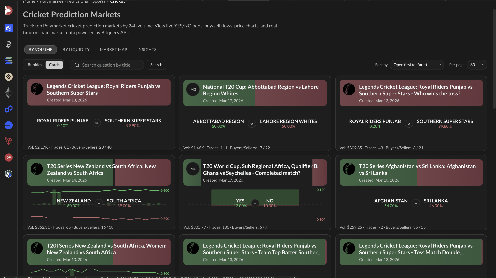
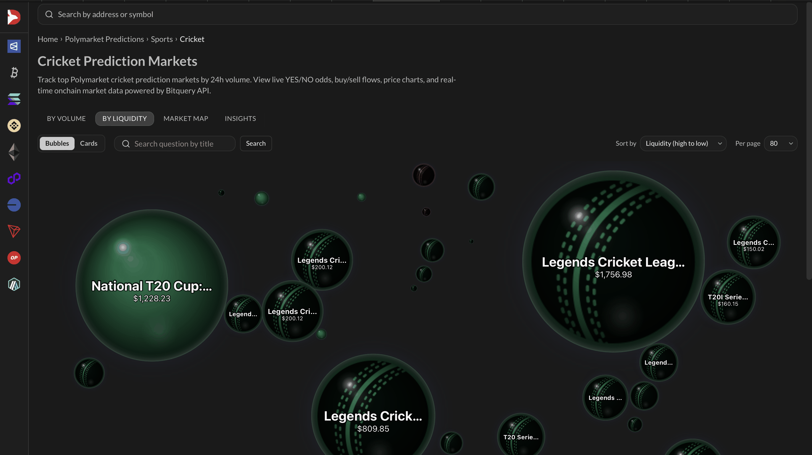

# Polymarket Sports API

Query **sports-related prediction markets** on Polymarket: **cricket** (e.g. via ESPN Cricinfo resolution source), **general sports** (by description), and **esports** (by outcome label). Use **PredictionManagements** for market creation events and **PredictionTrades** for trading activity. For **real-time** data, use the same operations as **GraphQL subscriptions** (change `query` to `subscription`) or **Kafka streams** — see [Real-time: GraphQL subscriptions and Kafka](#real-time-graphql-subscriptions-and-kafka) below.

:::note API Key Required
To query or stream data outside the Bitquery IDE, you need an API access token. See [How to generate Bitquery API token ➤](https://docs.bitquery.io/docs/authorisation/how-to-generate/).
:::

---

## How sports markets are identified

| Filter               | Use case                                                                    | Where to apply                                    |
| -------------------- | --------------------------------------------------------------------------- | ------------------------------------------------- |
| **ResolutionSource** | Markets resolved by a specific source (e.g. `espncricinfo.com` for cricket) | `Management.Prediction.Question.ResolutionSource` |
| **Description**      | General sports markets (keyword in management description)                  | `Management.Description`                          |
| **Outcome label**    | Trades on outcomes whose label contains a term (e.g. "Esports")             | `Trade.Prediction.Outcome.Label`                  |

---

### Real-time: GraphQL subscriptions and Kafka

#### GraphQL subscriptions

Any **query** on this page can be run in **real time** as a **subscription**: keep the same `where` filters and requested fields, and change the keyword **`query`** to **`subscription`**. You receive new events (market creations or trades) as they occur on Polygon via a WebSocket connection.

#### Kafka streams

For **ultra-low-latency** and high-throughput consumption, prediction market data (including sports) is also available via **Kafka**. The same lifecycle events and trades are delivered as Protocol Buffers on Polygon topics:

- **`matic.predictions.proto`** — Raw prediction market events (creations, resolutions, trades)
- **`matic.broadcasted.predictions.proto`** — Mempool prediction market data

Kafka requires **separate credentials** (IDE tokens do not work). See the full guide and topic list:

- **[Kafka Streaming Concepts](https://docs.bitquery.io/docs/streams/kafka-streaming-concepts/)** — Connect, subscribe, parse messages, and configure consumers.

For credentials, [contact support](https://t.me/bloxy_info) or email support@bitquery.io.

## Latest Fifa World Cup Markets Created

Markets resolved via **FIFA** (`ResolutionSource` includes `fifa.com`). Returns the 10 most recent **Created** events with full condition, outcomes, question, and collateral token details.

[Run in Bitquery IDE](https://ide.bitquery.io/Latest-Fifa-World-Cup-Markets-Created)

```graphql
query LatestFifaMarketsCreated {
  EVM(network: matic) {
    PredictionManagements(
      limit: { count: 10 }
      orderBy: { descending: Block_Time }
      where: {
        Management: {
          EventType: { is: "Created" }
          Prediction: {
            Question: { ResolutionSource: { includes: "fifa.com" } }
          }
        }
      }
    ) {
      Block {
        Time
      }
      Call {
        Signature {
          Name
        }
      }
      Log {
        Signature {
          Name
        }
        SmartContract
      }
      Management {
        Description
        EventType
        Prediction {
          CollateralToken {
            Name
            SmartContract
            Symbol
            AssetId
          }
          Condition {
            Id
            Oracle
            Outcomes {
              Id
              Index
              Label
            }
            QuestionId
          }
          Marketplace {
            ProtocolName
            ProtocolFamily
            SmartContract
          }
          Outcome {
            Id
            Index
            Label
          }
          OutcomeToken {
            Symbol
            SmartContract
            Name
            AssetId
          }
          Question {
            CreatedAt
            Id
            Image
            MarketId
            ResolutionSource
            Title
          }
        }
      }
      Transaction {
        From
        Hash
      }
    }
  }
}
```

## Top FIFA World Cup Markets by Volume
Markets resolved via **FIFA** (`ResolutionSource` includes `fifa.com`). Returns the top 100 cricket related polymarkets sorted by trading volume in the past 24 hours.

[Run in Bitquery IDE](https://ide.bitquery.io/top-FIFA-World-Cup-markets-by-volume)

```graphql
query TopFIFAMarketsByVolume($time_ago: Int!, $limit: Int!) {
  EVM(network: matic) {
    PredictionTrades(
      where: {Block: {Time: {since_relative: {hours_ago: $time_ago}}}, Trade: {Prediction: {Question: {ResolutionSource: {includes: "fifa.com"}}}}}
      limit: {count: $limit}
      orderBy: {descendingByField: "sumBuyAndSell"}
    ) {
      Trade {
        Prediction {
          Question {
            Id
            Image
            Title
            CreatedAt
          }
          OutcomeToken {
            assetId0: AssetId(if: {Trade: {Prediction: {Outcome: {Index: {eq: 0}}}}})
            assetId1: AssetId(if: {Trade: {Prediction: {Outcome: {Index: {eq: 1}}}}})
          }
          Outcome {
            label0: Label(if: {Trade: {Prediction: {Outcome: {Index: {eq: 0}}}}})
            label1: Label(if: {Trade: {Prediction: {Outcome: {Index: {eq: 1}}}}})
          }
        }
        OutcomeTrade {
          price0: Price(
            maximum: Block_Time
            if: {Trade: {Prediction: {Outcome: {Index: {eq: 0}}}}}
          )
          price1: Price(
            maximum: Block_Time
            if: {Trade: {Prediction: {Outcome: {Index: {eq: 1}}}}}
          )
        }
      }
      buyUSD: sum(
        of: Trade_OutcomeTrade_CollateralAmountInUSD
        if: {Trade: {OutcomeTrade: {IsOutcomeBuy: true}}}
      )
      sellUSD: sum(
        of: Trade_OutcomeTrade_CollateralAmountInUSD
        if: {Trade: {OutcomeTrade: {IsOutcomeBuy: false}}}
      )
      sumBuyAndSell: calculate(expression: "$buyUSD + $sellUSD")
      trades: count
      buyers: count(distinct: Trade_OutcomeTrade_Buyer)
      sellers: count(distinct: Trade_OutcomeTrade_Seller)
      resolved: joinPredictionManagements(
        join: left
        Management_Prediction_Question_Id: Trade_Prediction_Question_Id
      ) {
        Block {
          Time(maximum: Block_Time, if: {Management: {EventType: {is: "Resolved"}}})
        }
      }
    }
  }
}
```

Variables:

```json
{
  "time_ago": 24,
  "limit": 100
}
```

## Top FIFA World Cup Markets by Liquidity

Returns the top 100 FIFA World Cup related polymarkets sorted by liquidity position in the past 24 hours. Here `position` is the metric used for sorting, hence it could be regarded as the liquidity position of the particular market.

[Run in Bitquery IDE](https://ide.bitquery.io/Top-FIFA-World-Cup-Markets-by-Liquidity)

```graphql
query TopFIFAMarketByLiquidity($time_ago: Int!, $limit: Int!) {
  EVM(network: matic) {
    PredictionSettlements(
      where: {Block: {Time: {since_relative: {hours_ago: $time_ago}}}, Settlement: {Prediction: {Question: {ResolutionSource: {includes: "fifa.com"}}}}}
      limit: {count: $limit}
      orderBy: {descendingByField: "position"}
      limitBy: {by: Settlement_Prediction_Question_Id}
    ) {
      Settlement {
        Prediction {
          Question {
            Image
            MarketId
            Title
            Id
            CreatedAt
            ResolutionSource
          }
        }
      }
      split: sum(
        of: Settlement_Amounts_CollateralAmountInUSD
        if: {Settlement: {EventType: {is: "Split"}}}
      )
      merge: sum(
        of: Settlement_Amounts_CollateralAmountInUSD
        if: {Settlement: {EventType: {is: "Merge"}}}
      )
      position: calculate(expression: "$split - $merge")
      count(if: {Settlement: {EventType: {is: "Redemption"}}}, selectWhere: {eq: "0"})
    }
  }
}
```

Variables:

```json
{
  "time_ago": 24,
  "limit": 100
}
```

## Latest cricket markets created

Markets resolved via **ESPN Cricinfo** (`ResolutionSource` includes `espncricinfo.com`). Returns the 10 most recent **Created** events with full condition, outcomes, question, and collateral token details.

[Run in Bitquery IDE](https://ide.bitquery.io/Latest-Cricket-Markets-Created)

```graphql
query LatestCricketMarketsCreated {
  EVM(network: matic) {
    PredictionManagements(
      limit: { count: 10 }
      orderBy: { descending: Block_Time }
      where: {
        Management: {
          EventType: { is: "Created" }
          Prediction: {
            Question: { ResolutionSource: { includes: "espncricinfo.com" } }
          }
        }
      }
    ) {
      Block {
        Time
      }
      Call {
        Signature {
          Name
        }
      }
      Log {
        Signature {
          Name
        }
        SmartContract
      }
      Management {
        Description
        EventType
        Prediction {
          CollateralToken {
            Name
            SmartContract
            Symbol
            AssetId
          }
          Condition {
            Id
            Oracle
            Outcomes {
              Id
              Index
              Label
            }
            QuestionId
          }
          Marketplace {
            ProtocolName
            ProtocolFamily
            SmartContract
          }
          Outcome {
            Id
            Index
            Label
          }
          OutcomeToken {
            Symbol
            SmartContract
            Name
            AssetId
          }
          Question {
            CreatedAt
            Id
            Image
            MarketId
            ResolutionSource
            Title
          }
        }
      }
      Transaction {
        From
        Hash
      }
    }
  }
}
```

## Top Cricket Markets by Volume
Markets resolved via **ESPN Cricinfo** (`ResolutionSource` includes `espncricinfo.com`). Returns the top 100 cricket related polymarkets sorted by trading volume in the past 24 hours.

[Run in Bitquery IDE](https://ide.bitquery.io/top-cricket-markets-by-volume)

```graphql
query TopCricketMarketsByVolume($time_ago: Int!, $limit: Int!) {
  EVM(network: matic) {
    PredictionTrades(
      where: {Block: {Time: {since_relative: {hours_ago: $time_ago}}}, Trade: {Prediction: {Question: {ResolutionSource: {includes: "espncricinfo.com"}}}}}
      limit: {count: $limit}
      orderBy: {descendingByField: "sumBuyAndSell"}
    ) {
      Trade {
        Prediction {
          Question {
            Id
            Image
            Title
            CreatedAt
          }
          OutcomeToken {
            assetId0: AssetId(if: {Trade: {Prediction: {Outcome: {Index: {eq: 0}}}}})
            assetId1: AssetId(if: {Trade: {Prediction: {Outcome: {Index: {eq: 1}}}}})
          }
          Outcome {
            label0: Label(if: {Trade: {Prediction: {Outcome: {Index: {eq: 0}}}}})
            label1: Label(if: {Trade: {Prediction: {Outcome: {Index: {eq: 1}}}}})
          }
        }
        OutcomeTrade {
          price0: Price(
            maximum: Block_Time
            if: {Trade: {Prediction: {Outcome: {Index: {eq: 0}}}}}
          )
          price1: Price(
            maximum: Block_Time
            if: {Trade: {Prediction: {Outcome: {Index: {eq: 1}}}}}
          )
        }
      }
      buyUSD: sum(
        of: Trade_OutcomeTrade_CollateralAmountInUSD
        if: {Trade: {OutcomeTrade: {IsOutcomeBuy: true}}}
      )
      sellUSD: sum(
        of: Trade_OutcomeTrade_CollateralAmountInUSD
        if: {Trade: {OutcomeTrade: {IsOutcomeBuy: false}}}
      )
      sumBuyAndSell: calculate(expression: "$buyUSD + $sellUSD")
      trades: count
      buyers: count(distinct: Trade_OutcomeTrade_Buyer)
      sellers: count(distinct: Trade_OutcomeTrade_Seller)
      resolved: joinPredictionManagements(
        join: left
        Management_Prediction_Question_Id: Trade_Prediction_Question_Id
      ) {
        Block {
          Time(maximum: Block_Time, if: {Management: {EventType: {is: "Resolved"}}})
        }
      }
    }
  }
}
```

Variables:

```json
{
  "time_ago": 24,
  "limit": 100
}
```

You can checkout the above data in more intuitive form on [DexRabbit](https://dexrabbit.bitquery.io/polymarket-predictions/sports/cricket?tab=volume).



## Top Cricket Markets by Liquidity

Returns the top 100 cricket related polymarkets sorted by liquidity position in the past 24 hours.

[Run in Bitquery IDE](https://ide.bitquery.io/Top-cricket-Markets-by-Liquidity)

```graphql
query questionByLiquidity($time_ago: Int!, $limit: Int!) {
  EVM(network: matic) {
    PredictionSettlements(
      where: {Block: {Time: {since_relative: {hours_ago: $time_ago}}}, Settlement: {Prediction: {Question: {ResolutionSource: {includes: "espncricinfo.com"}}}}}
      limit: {count: $limit}
      orderBy: {descendingByField: "position"}
      limitBy: {by: Settlement_Prediction_Question_Id}
    ) {
      Settlement {
        Prediction {
          Question {
            Image
            MarketId
            Title
            Id
            CreatedAt
            ResolutionSource
          }
        }
      }
      split: sum(
        of: Settlement_Amounts_CollateralAmountInUSD
        if: {Settlement: {EventType: {is: "Split"}}}
      )
      merge: sum(
        of: Settlement_Amounts_CollateralAmountInUSD
        if: {Settlement: {EventType: {is: "Merge"}}}
      )
      position: calculate(expression: "$split - $merge")
      count(if: {Settlement: {EventType: {is: "Redemption"}}}, selectWhere: {eq: "0"})
    }
  }
}
```

Variables:

```json
{
  "time_ago": 24,
  "limit": 100
}
```

You can checkout the above data in more intuitive form on [DexRabbit](https://dexrabbit.bitquery.io/polymarket-predictions/sports/cricket?tab=liquidity).



## Latest sports markets created

Markets whose **management description** includes the word **"sports"**. Use this for broad sports coverage beyond a single resolution source. Returns the 10 most recent **Created** events.

[Run in Bitquery IDE](https://ide.bitquery.io/Latest-Sports-Markets-Created)

```graphql
query LatestSportsMarketsCreated {
  EVM(network: matic) {
    PredictionManagements(
      limit: { count: 10 }
      orderBy: { descending: Block_Time }
      where: {
        Management: {
          EventType: { is: "Created" }
          Description: { includes: "sports" }
        }
      }
    ) {
      Block {
        Time
      }
      Call {
        Signature {
          Name
        }
      }
      Log {
        Signature {
          Name
        }
        SmartContract
      }
      Management {
        Description
        EventType
        Prediction {
          CollateralToken {
            Name
            SmartContract
            Symbol
            AssetId
          }
          Condition {
            Id
            Oracle
            Outcomes {
              Id
              Index
              Label
            }
            QuestionId
          }
          Marketplace {
            ProtocolName
            ProtocolFamily
            SmartContract
          }
          Outcome {
            Id
            Index
            Label
          }
          OutcomeToken {
            Symbol
            SmartContract
            Name
            AssetId
          }
          Question {
            CreatedAt
            Id
            Image
            MarketId
            ResolutionSource
            Title
          }
        }
      }
      Transaction {
        From
        Hash
      }
    }
  }
}
```

## Latest esports prediction trades

Recent **trades** where the outcome **label** includes **"Esports"**. Returns up to 50 trades ordered by block time, with buyer, seller, amounts, price, and full prediction/question metadata.

[Run in Bitquery IDE](https://ide.bitquery.io/Latest-Esports-Prediction-Trades)

```graphql
query LatestEsportsPredictionTrades {
  EVM(network: matic) {
    PredictionTrades(
      limit: { count: 50 }
      orderBy: { descending: Block_Time }
      where: {
        TransactionStatus: { Success: true }
        Trade: { Prediction: { Outcome: { Label: { includes: "Esports" } } } }
      }
    ) {
      Block {
        Time
      }
      Call {
        Signature {
          Name
        }
      }
      Log {
        Signature {
          Name
        }
        SmartContract
      }
      Trade {
        OutcomeTrade {
          Buyer
          Seller
          Amount
          CollateralAmount
          CollateralAmountInUSD
          OrderId
          Price
          PriceInUSD
          IsOutcomeBuy
        }
        Prediction {
          CollateralToken {
            Name
            Symbol
            SmartContract
            AssetId
          }
          ConditionId
          OutcomeToken {
            Name
            Symbol
            SmartContract
            AssetId
          }
          Marketplace {
            SmartContract
            ProtocolVersion
            ProtocolName
            ProtocolFamily
          }
          Question {
            Title
            ResolutionSource
            Image
            MarketId
            Id
            CreatedAt
          }
          Outcome {
            Id
            Index
            Label
          }
        }
      }
      Transaction {
        From
        Hash
      }
    }
  }
}
```

---

## Polymarket-only filter

To restrict results to **Polymarket** only, add this to the relevant `where` clause:

**PredictionManagements:**

```graphql
Management: {
  Prediction: { Marketplace: { ProtocolName: { is: "polymarket" } } }
  # ... other filters
}
```

**PredictionTrades:**

```graphql
Trade: {
  Prediction: { Marketplace: { ProtocolName: { is: "polymarket" } } }
  # ... other filters
}
```

---

## Related APIs

| Need                                        | API                                                                                                                   |
| ------------------------------------------- | --------------------------------------------------------------------------------------------------------------------- |
| **Market lifecycle (creation, resolution)** | [Prediction Managements API](https://docs.bitquery.io/docs/examples/prediction-market/prediction-managements-api/)    |
| **Trades, volume, prices**                  | [Prediction Trades API](https://docs.bitquery.io/docs/examples/prediction-market/prediction-trades-api/)              |
| **Filter by slug, condition ID, token**     | [Polymarket Markets API](https://docs.bitquery.io/docs/examples/polymarket-api/polymarket-markets-api/)               |
| **Polymarket overview**                     | [Polymarket API](https://docs.bitquery.io/docs/examples/polymarket-api/polymarket-api/)                               |
| **Settlements & redemptions**               | [Prediction Settlements API](https://docs.bitquery.io/docs/examples/prediction-market/prediction-settlements-api/)    |
| **User & wallet activity**                  | [Polymarket Wallet & User Activity API](https://docs.bitquery.io/docs/examples/polymarket-api/polymarket-wallet-api/) |
| **Real-time: GraphQL subscriptions**        | [GraphQL subscriptions & WebSockets](https://docs.bitquery.io/docs/subscriptions/websockets/)                         |
| **Real-time: Kafka streams**                | [Kafka Streaming Concepts](https://docs.bitquery.io/docs/streams/kafka-streaming-concepts/)                           |

---

## Support

- [Bitquery Telegram](https://t.me/bloxy_info)
