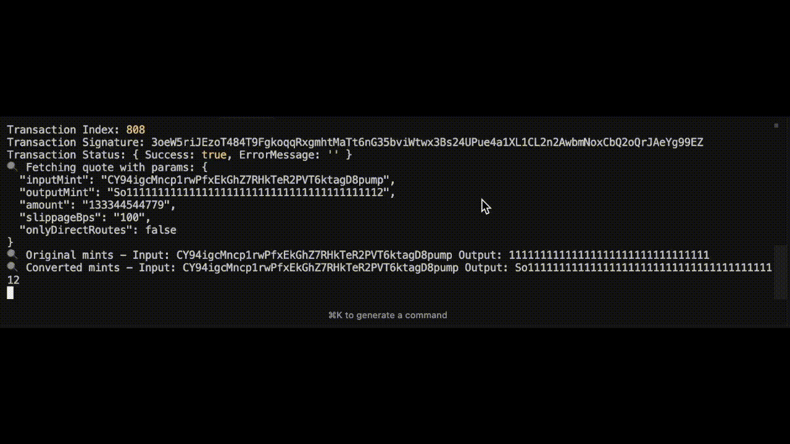

# Building Solana Copy Trading Bot with gRPC Streams

A comprehensive guide to building a **high-performance Solana trading bot** that leverages **gRPC streams** for real-time copy trading using [Bitquery CoreCast](https://docs.bitquery.io/docs/grpc/solana/introduction).

## Table of Contents

- [Architecture Overview](#architecture-overview)
- [Bitquery CoreCast Streams](#bitquery-corecast-integration)
- [Streaming Real-Time Solana DEX Trades](#streaming-real-time-solana-dex-trades)
- [Trade Execution with Jupiter API](#trade-execution-with-jupiter-api)
- [Code Walkthrough](#code-walkthrough)
- [Configuration & Filtering](#configuration--filtering)
- [Best Practices](#best-practices)
- [Output](#output)

---

## Output

The final result of this project would appear as the one given below.



## Architecture Overview

This **Solana trading bot** implements a streaming architecture for **copy trading**:

```
┌─────────────────────┐
│  Solana Blockchain  │
│   (DEX Trades)      │
└──────────┬──────────┘
           │
           ▼
┌─────────────────────────────────┐
│  Bitquery CoreCast gRPC Stream  │ ← Real-time data streaming
│  docs.bitquery.io/docs/grpc/   │
└──────────┬──────────────────────┘
           │
           ▼
┌─────────────────────┐
│  gRPC Client        │ ← @grpc/grpc-js
│  (CoreCast Proto)   │
└──────────┬──────────┘
           │
           ▼
┌─────────────────────┐
│  Event Handler      │ ← Trade filtering & strategy
└──────────┬──────────┘
           │
           ▼
┌─────────────────────┐
│  Jupiter Swap API   │ ← Optimal trade execution
└──────────┬──────────┘
           │
           ▼
┌─────────────────────┐
│  Solana Transaction │ ← On-chain execution
└─────────────────────┘
```

Learn more about [Bitquery CoreCast architecture](https://docs.bitquery.io/docs/grpc/solana/introduction/).

---

## Bitquery CoreCast Integration

[Bitquery CoreCast](https://docs.bitquery.io/docs/grpc/solana/introduction/) provides real-time blockchain data streaming via gRPC for **Solana trading bots**.

```javascript
// index.js - Loading Protocol Buffers
const { loadPackageDefination } = require('bitquery-corecast-proto');
const packageDefinition = loadPackageDefination();
const protoDescriptor = grpc.loadPackageDefinition(packageDefinition);
const solanaCorecast = protoDescriptor.solana_corecast;
```

Reference: [Protobuf Loading Documentation](https://www.npmjs.com/package/bitquery-corecast-proto)

---

## Streaming Real-Time Solana DEX Trades

### Initializing the gRPC Client

The bot connects to Bitquery's CoreCast server using the given below code snippet:

```javascript
// index.js - Client Initialization
function initializeClient() {
  client = new solanaCorecast.CoreCast(
    config.server.address,  // corecast.bitquery.io
    grpc.credentials.createSsl()
  );
  
  metadata = new grpc.Metadata();
  metadata.add('authorization', config.server.authorization);
}
```

Refer to [this document](https://docs.bitquery.io/docs/grpc/solana/authorisation/) for any issues related to authorisation.

### Creating the Stream

Multiple [Solana stream topics](https://docs.bitquery.io/docs/category/topics/) are available:

```javascript
// index.js - Stream Creation
function startStream() {
  const request = createRequest();
  let stream;
  
  switch (config.stream.type) {
    case 'dex_trades':      // Real-time DEX trades
      stream = client.DexTrades(request, metadata);
      break;
    case 'dex_orders':      // Order book updates
      stream = client.DexOrders(request, metadata);
      break;
    case 'transactions':    // All transactions
      stream = client.Transactions(request, metadata);
      break;
    // ... more stream types
  }
}
```

### Handling Stream Events

The bot processes incoming trade messages in real-time:

```javascript
// index.js - Event Handler
stream.on('data', async (message) => {
  if (message.Trade) {
    // Extract trade data from protobuf message
    const marketAddress = toBase58(message.Trade.Market?.MarketAddress);
    const inputMint = toBase58(message.Trade.Buy?.Currency?.MintAddress);
    const outputMint = toBase58(message.Trade.Sell?.Currency?.MintAddress);
    const buyAmount = message.Trade.Buy?.Amount;
    
    // Apply trading strategy
    if (approveTrade(buyAmount)) {
      await executeTrades({ inputMint, outputMint, marketAddress, buyAmount });
    }
  }
});

stream.on('error', (error) => {
  console.error('Stream error:', error);
});

stream.on('end', () => {
  console.log('Stream ended');
});
```

---

## Trade Execution with Jupiter API

### Native SOL Conversion

Jupiter requires wrapped SOL (wSOL) instead of native SOL for trading. Our bot handles this conversion:

```javascript
// trade.js - SOL Mint Conversion
const NATIVE_SOL_MINT = '11111111111111111111111111111111';
const WRAPPED_SOL_MINT = 'So11111111111111111111111111111111111111112';

const convertedInputMint = inputMint === NATIVE_SOL_MINT 
  ? WRAPPED_SOL_MINT 
  : inputMint;
```

### Fetching Swap Quotes

We use Jupiter's aggregation API to find optimal swap routes:

```javascript
// trade.js - Quote Fetching
const jupiter = createJupiterApiClient({ 
  basePath: 'https://quote-api.jup.ag/v6' 
});

const quoteReq = {
  inputMint: convertedInputMint,
  outputMint: convertedOutputMint,
  amount: amountInRaw,
  slippageBps: slippageBps.toString(),
  onlyDirectRoutes: false  // Allow indirect routes for better liquidity
};

const quote = await jupiter.quoteGet(quoteReq);
```

### Creating and Sending Transactions

Once we have a quote, we build and execute the swap transaction:

```javascript
// trade.js - Transaction Execution
const swapReq = {
  quoteResponse: quote,
  userPublicKey: wallet.publicKey.toString(),
  wrapAndUnwrapSOL: true,  // Handle SOL wrapping automatically
  asLegacyTransaction: true
};

const swapRes = await jupiter.swapPost({ swapRequest: swapReq });

// Deserialize and sign transaction
const txBuf = Buffer.from(swapRes.swapTransaction, 'base64');
const tx = Transaction.from(txBuf);
tx.sign([wallet]);

// Send to Solana network
const txSig = await connection.sendRawTransaction(
  tx.serialize(), 
  { skipPreflight: true, maxRetries: 3 }
);

// Wait for confirmation
await connection.confirmTransaction(txSig, 'confirmed');
```

---

## Code Walkthrough

### Helper Functions

#### Base58 Encoding

Solana addresses are encoded in base58. We convert byte arrays to base58 strings:

```javascript
// index.js - Base58 Conversion
function toBase58(bytes) {
  if (!bytes || bytes.length === 0) return 'undefined';
  try {
    return bs58.encode(bytes);
  } catch (error) {
    return 'invalid_address';
  }
}
```

### Configuration Management

The bot supports hot-reloading of configuration without restart:

```javascript
// index.js - Config Watching
fs.watch('./config.yaml', (eventType, filename) => {
  if (eventType === 'change') {
    clearTimeout(watchTimeout);
    watchTimeout = setTimeout(() => {
      reloadAndRestart();
    }, 300);  // Debounce rapid changes
  }
});
```

### Trading Strategy

Implement your **copy trading** logic in the `approveTrade()` function:

```javascript
// index.js - Trade Approval Logic
function approveTrade(buyAmount) {
  // Example: Only approve large trades
  if (buyAmount > 100 * 1000000000) {
    console.log('Approving large trade:', buyAmount);
    return true;
  }
  return false;
}
```

**Strategy Ideas:**
- Volume-based filtering
- Token whitelist/blacklist
- Risk management (max position size)
- Cooldown periods
- Multi-signal confirmation

---

## Configuration & Filtering

### Stream Configuration

Configure which on-chain activity to monitor:

```yaml
# config.yaml
stream:
  type: "dex_trades"  # Real-time DEX trades
```

**Available Stream Types:**
- `dex_trades` - [DEX trades](https://docs.bitquery.io/docs/grpc/solana/topics/dextrades/)
- `dex_orders` - [Order book data](https://docs.bitquery.io/docs/grpc/solana/topics/dexorder/)
- `dex_pools` - [Pool liquidity events](https://docs.bitquery.io/docs/grpc/solana/topics/dexpools/)
- `transactions` - [All transactions](https://docs.bitquery.io/docs/grpc/solana/topics/transactions/)
- `transfers` - [Token transfers](https://docs.bitquery.io/docs/grpc/solana/topics/transfer/)
- `balances` - [Balance updates](https://docs.bitquery.io/docs/grpc/solana/topics/balance/)

### Filters

Use [filtering options](https://docs.bitquery.io/docs/grpc/solana/filters/?utm_source=github&utm_medium=docs&utm_campaign=grpc_copytrading) to target specific trades:

```yaml
# config.yaml
filters:
  traders:  # Copy trades from specific addresses
    - "HV1KXxWFaSeriyFvXyx48FqG9BoFbfinB8njCJonqP7K"
  
  programs:  # Filter by DEX programs
    - "..." 
  
  pool:  # Filter by liquidity pools
    - "..."
  
  signers:  # Filter by transaction signers
    - "..."
```

```javascript
// index.js - Request Builder
function createRequest() {
  const request = {};
  
  if (config.filters.traders?.length > 0) {
    request.trader = { addresses: config.filters.traders };
  }
  
  if (config.filters.programs?.length > 0) {
    request.program = { addresses: config.filters.programs };
  }
  
  // ... more filter types
  
  return request;
}
```

---

## Best Practices

### 1. Error Handling

Implement comprehensive error handling for network failures:

```javascript
// trade.js - Error Handling
try {
  const quote = await jupiter.quoteGet(quoteReq);
} catch (error) {
  console.error('Jupiter API error:', error.response?.data || error.message);
  // Implement retry logic or fallback
}
```

### 2. Rate Limiting

To avoid being rate-limited by Jupiter:

```javascript
// Add delays between trades
await new Promise(resolve => setTimeout(resolve, 1000));
```

### 3. Monitoring

Log all trade executions for analysis:

```javascript
console.log('✅ Copy trade executed!', {
  tx: txSig,
  inputMint,
  outputMint,
  amount: buyAmount
});
```

### 4. Security

- Keep API keys in `secrets.json` (never commit)
- Use separate trading wallet
- Set maximum trade amounts
- Implement stop-loss mechanisms

### 5. Testing

Start with small amounts:

```javascript
// Reduce trade amount for testing
amountInRaw: (buyAmount / 100).toString()  // 1% of original
```

---

## Additional Resources

### Bitquery Documentation

- [CoreCast Introduction](https://docs.bitquery.io/docs/grpc/solana/introduction)
- [Authentication Guidelines](https://docs.bitquery.io/docs/grpc/solana/authorisation/)
- [Best Practises for gRPC streams](https://docs.bitquery.io/docs/grpc/solana/best_practices/)
- [Other Examples](https://docs.bitquery.io/docs/category/examples/)
- [Error Handling](https://docs.bitquery.io/docs/grpc/solana/errors/)

### External APIs

- [Jupiter Swap API](https://station.jup.ag/docs/apis/swap-api)
- [Solana Web3.js](https://solana-labs.github.io/solana-web3.js/)
- [Solana RPC](https://docs.solana.com/api/http)

### Get Started

[Sign up for Bitquery CoreCast](https://account.bitquery.io/auth/signup) and start building your **Solana copy trading bot** today!
