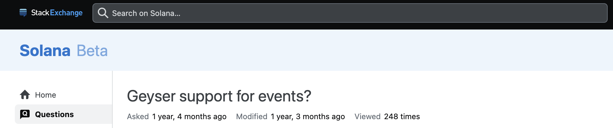
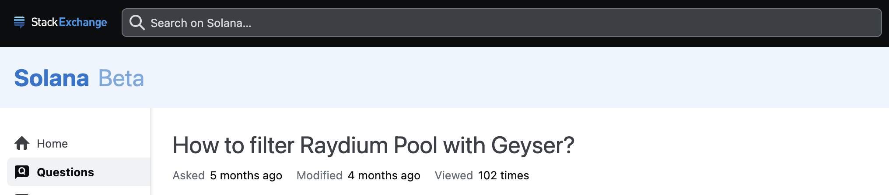
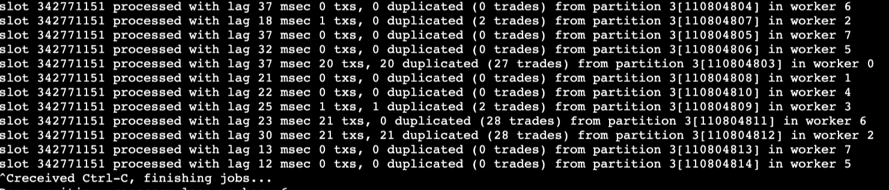

# The Need for Real-Time Data on Solana: Latency, Scale, and Fidelity at Stake

> “Better be first 99 percent of the time than second 100 percent of the time.”  
> — Donald MacKenzie, in his book _Trading at the Speed of Light_

Solana’s ultra-fast block times have created new possibilities for real-time blockchain apps, especially in trading, payments, and gaming.

Today, Solana handles around $25 billion in daily spot trading volume, surpassing even Binance, the largest centralised exchange, which does about $15 billion in daily spot volume.

Solana is leading the way in building a fast, scalable trading system on the blockchain. In the future, this won’t just be for crypto—it will make it possible to trade stocks, bonds, forex, commodities, and other assets all on-chain.

Building this kind of trading system requires advanced infrastructure, similar to what Nasdaq and other global exchanges use, and Low latency is an absolute necessity.

To succeed, developers need reliable access to real-time, low-latency on-chain data.

In this article, we’ll discuss the main ways to access ultra-low-latency data on Solana to support these applications at scale. Our focus here is on reading blockchain data; we’ll cover trade execution in a future article.

Because Solana’s validators are spread around the world, not in a single location, it’s challenging to deliver real-time information efficiently. Optimizing networks to relay blockchain data quickly is essential for many applications.

Let’s look at the different approaches to accessing real-time data on Solana, one by one.

## The Traditional Path: Solana Geyser Plugin

Solana offers the Geyser plugin system for developers needing direct access to on-chain events:

- **Update_account**: Triggered on account updates
- **Update_slot_status**: Slot status changes
- **Notify_transaction**: Processed transactions
- **Notify_block_metadata**: Block metadata

**Yellowstone Geyser Plugin** adds a gRPC API for subscribing to updates, getting blockhashes, slot numbers, and more.

### What are the challenges?

While powerful, Geyser requires running your own Solana node or validator. This means ongoing infrastructure management, manual scaling, node security, and raw data parsing tasks that can slow down even the best teams.

Filtering options are basic, so you may process much more data than you need, driving up costs and complexity.

People are asking questions on Stack Exchange about custom filtering options in Geyser, which Bitquery provides with just too much ease.

**[Ref 1:](https://solana.stackexchange.com/questions/9779/geyser-support-for-events)**  

**[Ref 2:](https://solana.stackexchange.com/questions/18663/how-to-filter-raydium-pool-with-geyser)**  

## Bitquery: A Powerful Alternative

Bitquery offers a powerful real-time streaming system with two easy-to-use interfaces: **GraphQL Subscriptions** and **Kafka**. You can learn more about the differences and benefits of each in the [Bitquery documentation](https://docs.bitquery.io/docs/streams/kafka-streaming-concepts/).

- **No Infra Needed**: You don’t need to run your own Solana node. Just use the Bitquery endpoint—no server costs, setup, or upgrades.
- **Powerful Filtering**: Use GraphQL’s expressive filters to get only the data you need (by address, token, program, amount, and more). No more sifting through irrelevant noise.
- **Pre-Parsed Data**: All data is already structured, labelled, and enriched (including USD values for tokens/trades). You save time and can focus on building features, not parsing raw logs.
- **Supports All Major DEXs**: Instantly access DEX trades from PumpFun, Raydium, Orca, and more, with no extra parsing.
- **Historical + Real-Time**: Query past data and stream new events using the same API.
- **Managed Reliability**: Bitquery handles uptime, redundancy, and failover—no late-night pages for you.
- **Easy Onboarding**: Get started in minutes, not weeks.

## Bitquery GraphQL Streams (with Powerful Filtering)

Bitquery’s GraphQL subscriptions give you real-time access with less than 2-second latency. Queries are rich and filterable, allowing you to stream only what you need, down to addresses, programs, or amounts.

You can test these queries live on the [Bitquery IDE](https://ide.bitquery.io/).

### Popular Bitquery GraphQL Streams:

- **Transfers**: Real-time token transfers (fungible and NFTs), filterable by address, amount, or specific programs.
- **Balance Updates**: Monitor wallet balances as they change, and see which programs trigger changes.
- **DEXTrades & DEXTradeByTokens**: Full trade history, OHLCV (K-line) data, trader stats, and DEX analytics—covering all major DEXs.
- **DEXPools**: Track liquidity adds, removes, and pool analytics in real time.
- **Instructions**: Stream parsed Solana program instructions—great for custom app monitoring and token launches.
- **Rewards**: Follow staking rewards live as they are distributed.
- **TokenSupplyUpdates**: Watch minting, burning, and supply changes in real time.
- **Transactions**: Get a live feed of all transactions on Solana.
- **Blocks**: Stream every new block as it’s produced.

### Custom Stream Filtering

Create targeted data streams for specific use cases:

- [Monitor 100 specific wallet addresses](https://docs.bitquery.io/docs/usecases/monitoring-solana-at-scale-managing-hundreds-of-addresses/) for whale tracking and large transaction alerts
- Custom token streams filtering by specific programs, amounts, or trading pairs. For eg: [track newly created pump fun tokens](https://docs.bitquery.io/docs/examples/Solana/Pump-Fun-API/#track-newly-created-pump-fun-tokens-creation-time-dev-address-metadata)
- Focus processing power only on relevant data, reducing costs and complexity

## Kafka Stream by Bitquery

Bitquery’s Kafka streams are a unique product that provides ultra-low latency data directly from blockchain. Here are some key features.

**[Bitquery offers three main Kafka streams](https://docs.bitquery.io/docs/streams/protobuf/chains/Solana-protobuf/)**:

- `solana.dextrades.proto` — Includes all trade and liquidity pool change data.
- `solana.tokens.proto` — Covers token transfers, supply changes, and balance updates at both the account and instruction level.
- `solana.transactions.proto` — Delivers detailed data for blocks, transactions, and instructions.

## Feature Comparison Table

| Feature                      | Geyser Plugin                          | Bitquery GraphQL Subscriptions             | Bitquery Kafka Stream                       |
| ---------------------------- | -------------------------------------- | ------------------------------------------ | ------------------------------------------- |
| **Node/Infra Required**      | Yes (self-managed node)                | No (cloud-managed by Bitquery)             | No (cloud-managed by Bitquery)              |
| **Setup Time**               | High (node setup, sync, maintain)      | Very Low (register & query)                | Low (register, integrate Kafka client)      |
| **Data Format**              | Raw, binary, or gRPC                   | Structured, JSON (GraphQL)                 | Structured, Protocol Buffers                |
| **Filtering**                | Limited (basic filters)                | Advanced (GraphQL-level filtering)         | By stream/topic and schema                  |
| **Data Coverage**            | Raw on-chain data                      | All Onchain data parsed (DEX, pools, etc.) | All Onchain data parsed (DEX, pools, etc.)  |
| **Unconfirmed Transactions** | Limited                                | Yes                                        | Yes (unconfirmed)                           |
| **Historical Data**          | No                                     | Yes (queryable)                            | No (stream only)                            |
| **Latency**                  | Low (depends on your infra)            | <2s (cloud-optimized)                      | Sub-second, ultra-low latency               |
| **Scalability**              | You must scale/monitor infra           | Scales automatically (SaaS)                | Enterprise-grade, scales automatically      |
| **Maintenance**              | High (updates, patches, uptime)        | None (managed by Bitquery)                 | None (managed by Bitquery)                  |
| **Data Parsing**             | Developer must parse raw data          | Pre-parsed & enriched (USD values, etc.)   | Pre-parsed & enriched                       |
| **DEX/Protocol Support**     | Needs custom parsing per DEX/protocol  | Supported out-of-the-box                   | Supported out-of-the-box                    |
| **Reliability/Failover**     | Developer’s responsibility             | Managed by Bitquery                        | Kafka’s built-in resilience + Bitquery      |
| **Best Use Cases**           | Deep custom infra, full control needed | Fast prototyping, dashboards, bots         | HFT, enterprise, large-scale real-time apps |

### Some Differentiators

- Geyser provides an entry notification stream for tracking ledger entries in real time.
- Bitquery Streams work directly with unconfirmed transactions and do not offer a separate entry notification stream.
- Because Bitquery focuses on unconfirmed transactions, it can deliver block data before blocks are closed, often faster than other solutions.
- Bitquery Streams include: Real-time instruction and log parsing, and Instruction-level balance updates (showing balance changes from each instruction). Even Geyser does not provide instruction-level balance updates natively.

## Key Advantages of Subscriptions and Kafka for Solana Applications

### Ultra-Low Latency & Real-Time Processing

Kafka streams deliver sub-second latency, crucial for high-frequency trading where Solana processes $25+ billion in daily volume. Access to unconfirmed transactions provides early market signals before block finalization. Latency goes to as low as 4–5ms.

### Enterprise Scalability

Kafka's distributed architecture handles massive throughput with built-in replication and automatic failover. Scale from thousands to millions of transactions per second without infrastructure management.

Read this tutorial on [how to use Bitquery’s Kafka Streams to monitor millions of Solana wallet balances](https://docs.bitquery.io/docs/usecases/track-millions-of-solana-wallets/).

Also, check out how you can [track withdrawals and deposits for 1000s of Binance exchange wallets](https://docs.bitquery.io/docs/usecases/binance-exchange-wallet-monitoring/).

### Development Efficiency

Pre-parsed, enriched data with USD values and protocol information eliminates complex parsing work. Zero node management means faster time-to-market for trading systems and DeFi applications.

## Conclusion

If you’re building on Solana, Bitquery’s streaming solutions are built for developers who demand more—less setup, more speed, and richer data out of the box. With Bitquery GraphQL Subscriptions, you get clean, filtered, and pre-parsed blockchain data in minutes, while Kafka Streams give you ultra-low latency and enterprise-grade scalability for the most demanding real-time apps.

Curious to see what next-gen blockchain data feels like? Try Bitquery Streams and experience the technical difference for yourself. Your next Solana project just got a whole lot easier.
