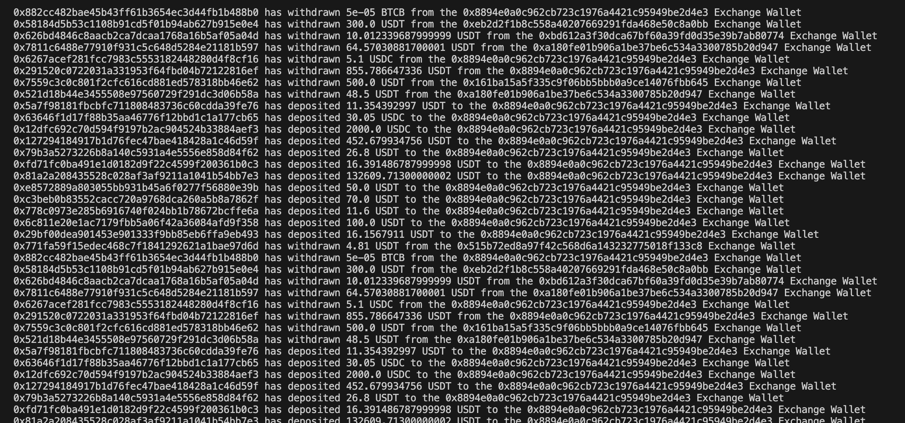

# Monitoring Withdrawals and Deposits for 1000s of Binance Exchange Wallets

In this guide we will utilize the [Protobuf Kafka streams](docs/streams/protobuf/kafka-protobuf-python.md) provided by Bitquery to monitor withdrawls and deposits for a large number of Binance Exchange Wallets on BSC network.  You can read more about Kafka solution by Bitquery [here](docs/streams/kafka-streaming-concepts.md).

Checkout the complete [codebase](https://github.com/bitquery/binance-exchange-wallets-monitoring) for any issues in the tutorial.

## Prerequisites

1. Create a project folder with the given command.

```shell
mkdir bsc-exchange-wallet-monitoring
```

2. Install the dependencies using the command line.

```shell
pip install bitquery-pb2-kafka-package
```

3. Create the file structure with the following commands.

```shell
touch main.py
mkdir helpers
cd helpers
touch convert_bytes.py
```

## Helper Functions

In this section we will discuss the code written inside the helpers folder.

### Convert Bytes

This functions takes the base58 encoded bytes as parameter and returns readable string values.

```python
import base58

def convert_bytes(value, encoding='hex'):
    if encoding == 'base58':
        return base58.b58encode(value).decode()
    else:
        return value.hex()
```

## Imports

```python
import os
import uuid
from confluent_kafka import Consumer, KafkaError, KafkaException
from google.protobuf.message import DecodeError
from evm import token_block_message_pb2
import binascii
import base58
import json
from helpers.convert_bytes import convert_bytes 
from helpers.print_protobuf_message import print_protobuf_message
```

## Creating Kafka Configuration

The credentials such as `username` and `password` could be received by contacting the Bitquery team via - sales@bitquery.io

```python
group_id_suffix = uuid.uuid4().hex

conf = {
    'bootstrap.servers': 'rpk0.bitquery.io:9092,rpk1.bitquery.io:9092,rpk2.bitquery.io:9092',
    'group.id': f'{username}-group-{group_id_suffix}',  
    'session.timeout.ms': 30000,
    'security.protocol': 'SASL_PLAINTEXT',
    'ssl.endpoint.identification.algorithm': 'none',
    'sasl.mechanisms': 'SCRAM-SHA-512',
    'sasl.username': username,
    'sasl.password': password,
    'auto.offset.reset': 'latest',
}
```

## Creating Consumer and Subcribing to Topic
The topic to subscribe should be selected based on the usecase. In this case we are looking to track the deposits and withrawls of tokens for a list of Binance Exchange Wallets, thus `bsc.tokens.proto` would be the best choice.

```python
consumer = Consumer(conf)
topic = 'bsc.tokens.proto'
consumer.subscribe([topic])
```

## Creating Set of Binance Exchange Wallets

For the purpose of tutorial we have directly created a set containing a bunch of Binance exchange wallet addresses. When building an enterprise grade solution where the number of wallets are in thousands or millions, the set could be saved in a seperate file. The wallets are stored in a set instead of list due to fast lookup in sets.

```python
wallets = {
    '0xf977814e90da44bfa03b6295a0616a897441acec', 
    '0xBE0eB53F46cd790Cd13851d5EFf43D12404d33E8', 
    '0x5a52e96bacdabb82fd05763e25335261b270efcb',
    '0x3c783c21a0383057d128bae431894a5c19f9cf06',
    '0xdccf3b77da55107280bd850ea519df3705d1a75a',
    '0x8894e0a0c962cb723c1976a4421c95949be2d4e3',
    '0x515b72ed8a97f42c568d6a143232775018f133c8',
    '0xbd612a3f30dca67bf60a39fd0d35e39b7ab80774',
    '0x01c952174c24e1210d26961d456a77a39e1f0bb0',
    '0x29bdfbf7d27462a2d115748ace2bd71a2646946c',
    '0x73f5ebe90f27b46ea12e5795d16c4b408b19cc6f',
    '0x161ba15a5f335c9f06bb5bbb0a9ce14076fbb645',
    '0x1fbe2acee135d991592f167ac371f3dd893a508b',
    '0xeb2d2f1b8c558a40207669291fda468e50c8a0bb',
    '0xa180fe01b906a1be37be6c534a3300785b20d947'
}
```

## Proccess Message Function

This function receives the message from the stream as a parameter. The message contains a list of token transfers and the function checks if either of the `sender` or `receiver` are present in the set defined earlier. If either of the condition is satisfied then it prints the message displayed in the [Final Results](#final-result) section.

```python
def process_message(message):
    try:
        buffer = message.value()
        parsed_message = token_block_message_pb2.TokenBlockMessage()
        parsed_message.ParseFromString(buffer)
        transfers = parsed_message.Transfers

        for transfer in transfers:
            sender = '0x' + convert_bytes(transfer.Sender)
            receiver = '0x' + convert_bytes(transfer.Receiver)
            amount = int.from_bytes(transfer.Amount, byteorder='big')/10e18
            currency = transfer.Currency
            symbol = currency.Symbol

            if sender in wallets:
                print(receiver, "has withdrawn", amount, symbol, "from the", sender, "Exchange Wallet")
            elif receiver in wallets:
                print(sender, "has deposited", amount, symbol, "to the", receiver, "Exchange Wallet")

    except DecodeError as err:
        print(f"Protobuf decoding error: {err}")
    except Exception as err:
        print(f"Error processing message: {err}")

```

##  Poll and Monitor Activities in Real Time

This is the main loop for consuming Kafka messages and monitoring the exchange wallets activities in real time.

```python
try:
    while True:
        msg = consumer.poll(timeout=1.0)
        if msg is None:
            continue
        if msg.error():
            if msg.error().code() == KafkaError._PARTITION_EOF:
                continue
            else:
                raise KafkaException(msg.error())
        process_message(msg)

except KeyboardInterrupt:
    print("\nStopping consumer...")
finally:
    consumer.close()
```

## Running the Script

Run this command line to run the `main.py` script.

```shell
python main.py
```

## Final Result


