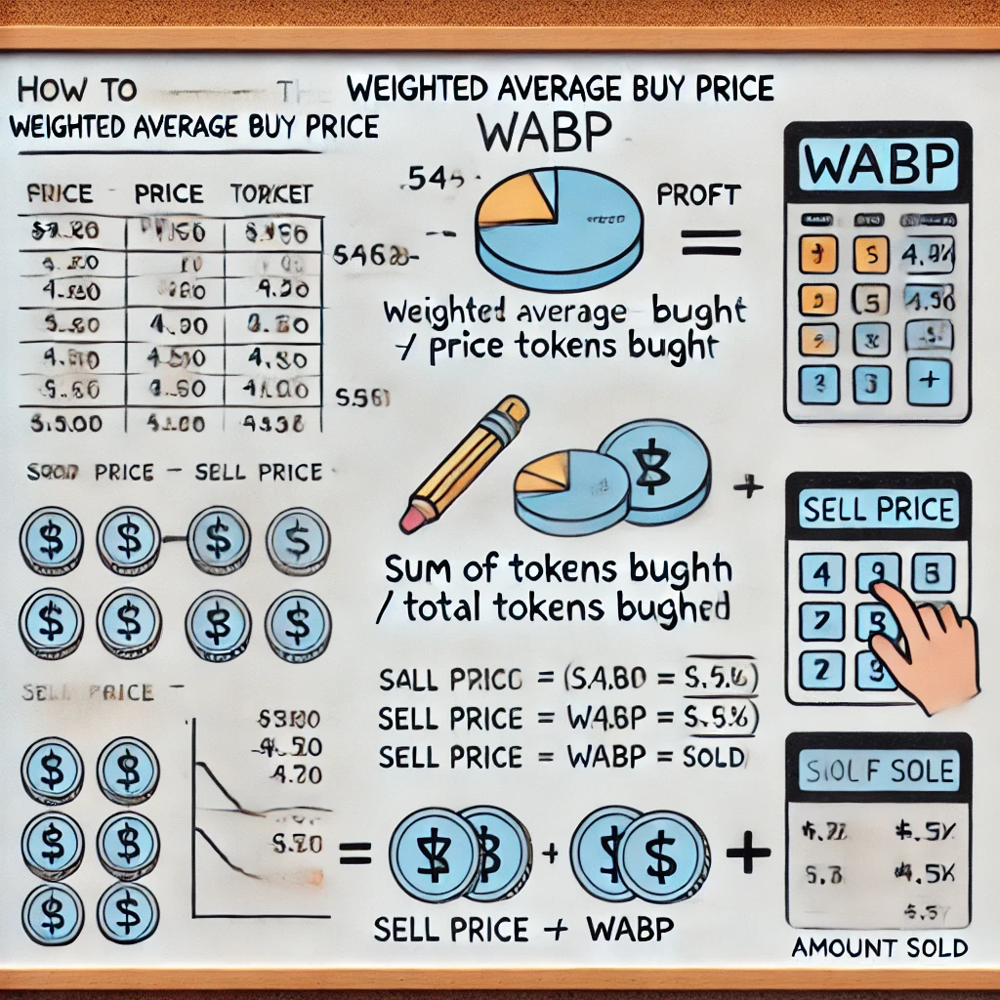

# Overview

Profit and Loss calculation in crypto is not easy to build. However, it is an important metric while evaluating the financial performance of an asset. In this tutorial, we will see how to build a simple profit and loss calculator in Javascript using Bitquery's [DEXTrades API](https://docs.bitquery.io/docs/examples/dextrades/dex-api/)

## Realized PnL
We will be calculating realised profit and loss. Realized PnL is calculated after traders have sold their holdings of a token. Only the executed price of the orders is taken into account in realized PnL. For this purpose, we will the weighted average of the buy price(WABP) in USD.

This is the formula we will be using:

```
WABP = sum(buyAmount*buyPriceInUSD)/sum(buyAmount)
pnl = sum(sellAmount*(sellPriceInUSD-WABP))
```



Click  [here](https://docs.bitquery.io/docs/usecases/p-l-product/pnl) to get started with the project.