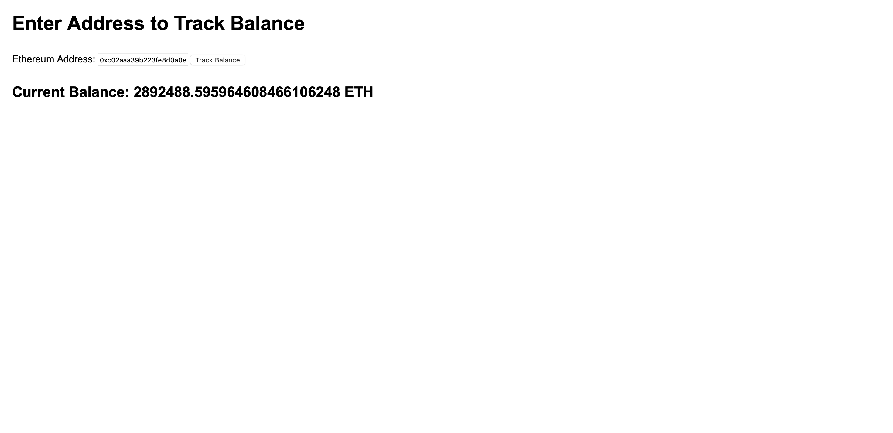

# Building a Basic UI for Balance Tracker

In this section we will create a simple UI using HTML, CSS and JavaScript to make the real-time Balance Tracker intuitive. For that we will create a HTML file named `index.js` in the same directory.

## HTML Code

``` html
<!DOCTYPE html>
<html lang="en">
<head>
    <meta charset="UTF-8">
    <meta name="viewport" content="width=device-width, initial-scale=1.0">
    <title>Real-Time Balance Tracker</title>
    <style>
        body {
            font-family: Arial, sans-serif;
            margin: 20px;
        }
        label, input, button {
            margin: 10px 0;
        }
        /* Spinner styles */
        .spinner {
            border: 4px solid rgba(0, 0, 0, 0.1);
            width: 36px;
            height: 36px;
            border-radius: 50%;
            border-left-color: #09f;
            animation: spin 1s ease infinite;
            display: none;
            margin: 20px auto;
        }
        @keyframes spin {
            0% {
                transform: rotate(0deg);
            }
            100% {
                transform: rotate(360deg);
            }
        }
    </style>
</head>
<body>
    <h1>Enter Address to Track Balance</h1>
    <form id="balance-form">
        <label for="address">Ethereum Address:</label>
        <input type="text" id="address" required>
        <button type="submit">Track Balance</button>
    </form>
    
    <!-- Loading Spinner -->
    <div class="spinner" id="loading-spinner"></div>

    <h2>Current Balance: <span id="balance">0</span> ETH</h2>

    <script>
        const form = document.getElementById('balance-form');
        const balanceDisplay = document.getElementById('balance');
        const spinner = document.getElementById('loading-spinner');
        let intervalId;

        form.addEventListener('submit', function(event) {
            event.preventDefault();
            const address = document.getElementById('address').value;
            
            // Show loading spinner
            spinner.style.display = 'block';
            balanceDisplay.textContent = 'Loading...';

            if (intervalId) {
                clearInterval(intervalId); // Clear any previous intervals
            }

            // Send address to backend
            fetch('/track-balance', {
                method: 'POST',
                headers: {
                    'Content-Type': 'application/json',
                },
                body: JSON.stringify({ address }),
            })
            .then(response => response.json())
            .then(data => {
                if (data.success) {
                    // Fetch balance every 10 seconds
                    intervalId = setInterval(() => {
                        fetch('/get-balance')
                        .then(response => response.json())
                        .then(data => {
                            balanceDisplay.textContent = data.balance;
                            spinner.style.display = 'none';  // Hide spinner once the balance is fetched
                        });
                    }, 10000);
                } else {
                    alert('Error tracking balance');
                    spinner.style.display = 'none';  // Hide spinner in case of error
                }
            });
        });
    </script>
</body>
</html>
```

To run the project run the following command:

```
node index.js
```

Now we can check the UI and test the project by visiting `localhost:3000`.

**Note:** Make sure that the port 3000 is free.

## Final Results

This is how the real-time Balance Tracker UI looks. You can enter any wallet address of your choice and track its activities, by tracking its Ethereum Balance changes in real-time.



To avoid redundancy, it updates the balance every 10 seconds.