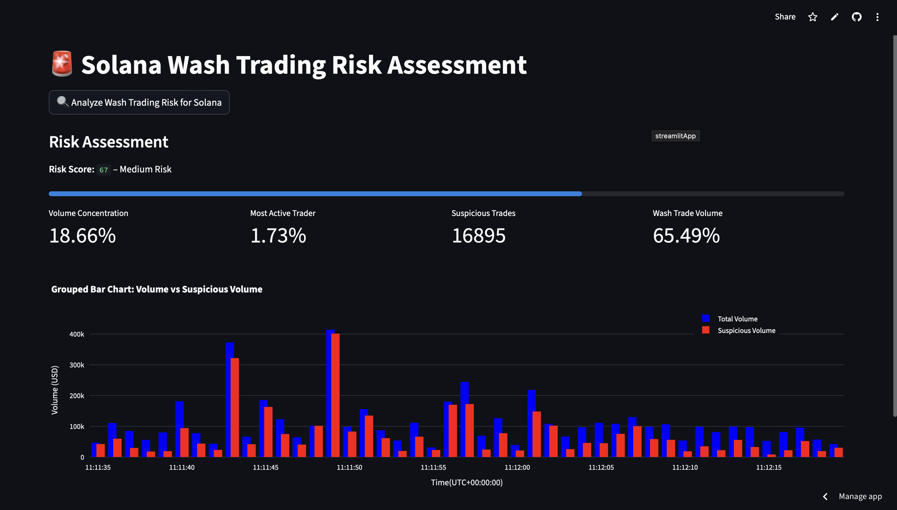

# Solana Wash Trading Dashboard

This script runs an interactive Streamlit web application that:

- Loads fresh Solana DEX trade data from Bitquery.
- Applies a trained XGBoost model to detect wash trading.
- Calculates various risk metrics.
- Displays dynamic, real-time visualizations.

## Code Braakdown

### Imports
Refer to the [file structure](../overview/#project-structure) to make sure that the imports are correct.
```py
import streamlit as st
import pandas as pd
import pickle
import matplotlib.pyplot as plt
from sklearn.preprocessing import LabelEncoder
import plotly.graph_objects as go
import json
from get_data import get_trades
```

### Load Model and Features

The code given below loads your pre-trained XGBoost model and the feature list used during training to ensure correct column alignment.

```py
model = pickle.load(open("xgb_wash_model.pkl", "rb"))

with open("model_features.json", "r") as f:
    feature_cols = json.load(f)
```

### Fetch and Prepare Data

This code fetch the latest Solana DEX trades using Bitquery API, flattens nested JSON into a usable DataFrame, encode categorical features and align the data with training features.

```py
trade_data = get_trades()
df = pd.json_normalize(trade_data)

X = df.copy()

for col in X.select_dtypes(include="object").columns:
    X[col] = LabelEncoder().fit_transform(X[col].astype(str))

for col in feature_cols:
    if col not in X.columns:
        X[col] = 0
X = X[feature_cols]
```

### Run Predictions and Compute Risk Score

This code adds a new column prediction indicating suspected wash trades and computes an overall risk score (0–100).

```py
df["prediction"] = model.predict(X)
wash_count = int(df["prediction"].sum())
total_trades = len(df)
risk_score = min(100, int((wash_count / total_trades) * 100)) if total_trades else 0
```

### Compute Key Metrics

The code given below returns:
1. Cleaned timestamp for resampling.
2. Buy volume in USD
3. Suspicious volume based on model prediction
4. Top 10 wallets' volume share
5. Most active wallet’s trade contribution
6. % of volume flagged as suspicious

```py
df["timestamp"] = pd.to_datetime(df["Block.Time"], errors="coerce")
df["volume"] = pd.to_numeric(df["Trade.Buy.AmountInUSD"], errors="coerce").fillna(0)
df["suspiciousVolume"] = df.apply(
    lambda row: row["volume"] if row["prediction"] == 1 else 0,
    axis=1
)
top_wallets = df.groupby("Trade.Buy.Account.Address")["volume"].sum().sort_values(ascending=False)

total_volume = top_wallets.sum()
top_10_volume = top_wallets.head(10).sum()
volume_concentration = round(100 * top_10_volume / total_volume, 2)

top_wallet_trade_count = df["Trade.Buy.Account.Address"].value_counts().iloc[0]
wallet_contribution = round(100 * top_wallet_trade_count / len(df), 2)

wash_volume_pct = round(100 * df["suspiciousVolume"].sum() / df["volume"].sum(), 2)
```

### Streamlit App Setup
This code initializes the Streamlit app with a title and a button.

```py
st.set_page_config(page_title="Solana Wash Trade Risk Dashboard", layout="wide")

st.title("🚨 Solana Wash Trading Risk Assessment")

st.button("🔍 Analyze Wash Trading Risk for Solana")
```

### Show Risk Metrics

The below code renders `Risk Score` and `Trading Metrics` on the Streamlit app.

```py
st.subheader("Risk Assessment")
st.markdown(f"**Risk Score: `{risk_score}`** – {'High' if risk_score > 70 else 'Medium' if risk_score > 40 else 'Low'} Risk")
st.progress(risk_score / 100)

col1, col2, col3, col4 = st.columns(4)
col1.metric("Volume Concentration", f"{volume_concentration}%")
col2.metric("Most Active Trader", f"{wallet_contribution}%")
col3.metric("Suspicious Trades", f"{wash_count}")
col4.metric("Wash Trade Volume", f"{wash_volume_pct}%")
```

### Plot Volume Chart (Total vs Suspicious)

The below code renders a bar chart of total trade volume v/s the suspicious volume for a timeframe of `1s`.

```py
df.set_index("timestamp", inplace=True)
agg = df.resample("1s").agg({
    "volume": "sum",
    "suspiciousVolume": "sum"
}).fillna(0).reset_index()

fig = go.Figure()

# Blue bars = total volume
fig.add_trace(go.Bar(
    x=agg["timestamp"],
    y=agg["volume"],
    name="Total Volume",
    marker_color="blue",
    width=500
))

# Red bars = suspicious volume
fig.add_trace(go.Bar(
    x=agg["timestamp"],
    y=agg["suspiciousVolume"],
    name="Suspicious Volume",
    marker_color="red",
    width=500
))

fig.update_layout(
    barmode="group",
    title="Grouped Bar Chart: Volume vs Suspicious Volume",
    xaxis_title="Time(UTC+00:00:00)",
    yaxis_title="Volume (USD)",
    xaxis_tickformat="%H:%M:%S",
    legend=dict(x=0.8, y=1.1),
    bargap=0.4,
    bargroupgap=0.1,
    height=400,
)

st.plotly_chart(fig, use_container_width=True)
```

### Raw Data Toggle

The below code allows to optionally show the full processed dataset (including predictions and timestamps).

```py
if st.checkbox("Show Raw Trade Data"):
    st.dataframe(df)
```

## Deployment via Streamlit

You can deploy this dashboard to Streamlit Cloud in a few easy steps just as this [Live Demo](https://washtrade.streamlit.app).

### Add `requirements.txt`

In the project repository add the following `requirements.txt` file.

```txt
streamlit
pandas
scikit-learn
xgboost
matplotlib
plotly
```
### Deploy on Streamlit Cloud

1. Go to [Streamlit Cloud](https://streamlit.io/cloud).
2. Click "New App".
3. Connect your GitHub repo.
4. Set app.py as the entry point.
5. Add your [access token](https://account.bitquery.io/user/api_v2/access_tokens) in Secrets.
6. Click Deploy.

## Final Product

The final product looks like the image given below.

